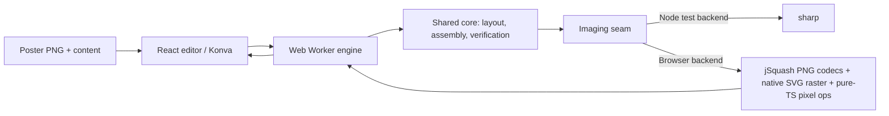

# Client-side rendering migration

Status: planned. This document specifies moving the prepare/assemble pipeline out of the Node route handlers into the browser, and removing the render API once the client path is verified. When implemented it supersedes the server-rendering sections of `web-qr-poster.md` (Node route handlers, stateless multipart requests, base64 artifacts).

## Problem

Every edit round-trips the full pipeline. The browser re-uploads the poster (and mask) as multipart form data, and the stateless server re-runs everything from scratch: PNG decode, region detection, QR generation, SVG rasterization, assembly, pixel verification, PNG encode, base64 JSON. `handleEditorRequest` is single-flight, so a superseded request returns `503 BUSY`, and each prepare fires on a 450 ms debounce after every revision change. The perceived lag is dominated by the upload round trip and the repeated decode/detect work, not by sharp's raw speed.

The fix has two halves:

1. Run the pipeline in the browser, keeping decoded state in memory so an edit only re-runs what changed.
2. Remove the server render API after the browser path passes the same verification, per the maintainer's decision. No long-term server fallback.

## Library decision

| Candidate                  | Verdict                                                                                                                                   | Role                                                                                                                                                  |
| -------------------------- | ----------------------------------------------------------------------------------------------------------------------------------------- | ----------------------------------------------------------------------------------------------------------------------------------------------------- |
| `squoosh-kit`              | Rejected. Registered 2025-10-21; its only published version (0.0.1) was unpublished the next day. Not installable, no maintenance signal. | —                                                                                                                                                     |
| `jSquash` (`@jsquash/png`) | Adopted as the codec layer only. Actively maintained, ESM, browser-first WASM codecs derived from Squoosh.                                | Strict PNG decode (≈ `failOn: 'error'` parity, exact RGBA) and PNG encode. `@jsquash/oxipng` is a later optional upgrade if export file size matters. |

jSquash only converts bytes ↔ pixels. The operations this codebase actually needs beyond that — SVG rasterization, compositing, flatten, nearest-neighbor resize — are done with browser primitives and shared pure-TypeScript, which is how Squoosh-the-app itself worked:

- **PNG decode** → `@jsquash/png` (strict decoder, no canvas premultiply or color-management pitfalls).
- **PNG encode** → `@jsquash/png` (encode only at export; previews stay raw).
- **SVG → pixels** → native rasterizer (`Image`/`createImageBitmap` → `OffscreenCanvas` → `getImageData`).
- **Composite / flatten / nearest resize** → pure-TS pixel loops shared by both backends, so behavior cannot drift between environments.

`sharp` is retained as a dev dependency: after the API removal it exists only as the Node test backend for `src/core/` under Vitest.

## Target architecture

- `src/core/imaging/` gains an `Imaging` interface with two implementations: `node.ts` (sharp, used by tests and scripts) and `browser.ts` (jSquash + native rasterizer). The implementation is chosen by environment via dynamic `import()`, so sharp never enters the client bundle and the WASM modules stay lazy-loaded.
- The orchestration currently in `src/server/editor.ts` (`resolveBuffers`, `prepareEditor`, `assembleFromBuffers`, placement recentering, error-to-field mapping) moves to isomorphic `src/lib/editor/engine/` modules. The core algorithms in `src/core/` are unchanged.
- The engine runs in a Web Worker with a single-flight queue (replacing the server's `BUSY` gate). It caches the decoded poster, mask, and region mask keyed by file sha256: an edit that only changes placement, seed, or settings re-runs geometry and assembly; a content/ecc change only regenerates the QR; a new file re-runs detection.
- Mandatory schema-8 verification keeps running unchanged — in the browser. Only the final export is PNG-encoded; preview artifacts stay raw pixels/Blob URLs instead of base64 strings.
- `GET /api/icons` is a thin icon-search proxy unrelated to the render pipeline; it stays.

## Operation replacement map

| Current sharp use                                                           | Browser replacement                                                                                                                                               | Notes                                                                                                                                                                                                                                                      |
| --------------------------------------------------------------------------- | ----------------------------------------------------------------------------------------------------------------------------------------------------------------- | ---------------------------------------------------------------------------------------------------------------------------------------------------------------------------------------------------------------------------------------------------------- |
| `decodePng` (`src/core/image.ts`)                                           | `@jsquash/png` decode → RGBA                                                                                                                                      | Exact, lossless; replaces `ensureAlpha().raw()`.                                                                                                                                                                                                           |
| `rgbaToPng`, `grayscaleToPng` (`src/core/image.ts`)                         | `@jsquash/png` encode; grayscale expands to RGBA first                                                                                                            | Export only.                                                                                                                                                                                                                                               |
| SVG → raw (`pattern-cut.ts:484`, `module-cut.ts:404`, `pattern.ts:285`)     | Native raster: `Image`/`createImageBitmap` → `OffscreenCanvas` → `getImageData`                                                                                   | Simple shape SVGs (paths, circles, `fill-rule`, `clip-path`); no text or external refs. `rasterizeSvg` stays a swappable primitive with a main-thread `Image` fallback for engines where worker `createImageBitmap` from SVG blobs is unreliable (Safari). |
| `composite(overlays)` (`src/core/qr.ts:89`)                                 | Pure-TS composite on raw pixels                                                                                                                                   | Shared by both backends.                                                                                                                                                                                                                                   |
| flatten + nearest resize (`src/core/qr.ts:555`, `src/core/assemble.ts:211`) | Pure-TS flatten-over-white and integer nearest resample                                                                                                           | Exact; no resampling ambiguity.                                                                                                                                                                                                                            |
| metadata / format / single-frame checks (`src/server/editor.ts:40`)         | Client-side PNG header parse: 8-byte signature, IHDR dimensions, `acTL` chunk scan (rejects APNG, parity with the `pages !== 1` check), byte and megapixel limits | Same `PNG_INVALID` / `UPLOAD_LIMIT` error codes.                                                                                                                                                                                                           |
| `createHash('sha256')` (`src/core/image.ts`)                                | `crypto.subtle.digest` in the browser; `node:crypto` in the Node backend                                                                                          | Both async; feeds the cache key and reports.                                                                                                                                                                                                               |
| `Buffer` in core signatures                                                 | Standardize core on `Uint8Array`                                                                                                                                  | `Buffer` extends `Uint8Array`, so Node callers keep working; no client `Buffer` polyfill.                                                                                                                                                                  |

## Sequenced implementation and gates

### 1. Extract the imaging seam (no behavior change)

- Add `src/core/imaging/types.ts` (decode/encode/rasterizeSvg), `node.ts` (sharp), and `pixels.ts` (pure-TS composite/flatten/resizeNearest, with the sharp backend delegating to them).
- Route the eight sharp call sites through the seam; replace `Buffer` with `Uint8Array` in core signatures; give sha256 an environment split.
- Gate: `pnpm test`, `pnpm typecheck`, `pnpm build` pass and outputs are bit-identical; the existing Vitest suite runs unchanged against the Node backend.

### 2. Browser imaging backend and parity harness

- Implement `src/core/imaging/browser.ts`; wire the jSquash WASM assets through Next/Turbopack (dynamic import inside the worker); port the upload guards (signature, IHDR, `acTL`, limits) client-side.
- Build a parity harness: identical inputs through the Node and browser backends, comparing artifacts pixel by pixel with tolerance only on SVG-antialiased edges.
- Gate: parity harness passes on the fixture set (`source/poster.png`, `test/fixtures/qr.png`, blank/text/icon masks); a corrupt, APNG, or oversized PNG produces the same error codes client-side.

### 3. Client engine in a Web Worker

- Move `resolveBuffers`/`prepareEditor`/`assembleFromBuffers`, placement recentering, and error-to-field mapping into `src/lib/editor/engine/`, environment-agnostic and testable in Node with the sharp backend.
- Add the worker host: transferable buffers, sha256-keyed decode/detect cache, single-flight queue, cancellation for superseded revisions, zod validation before each run.
- Move `@zxing/library` and `jsqr` from `serverExternalPackages` into the worker bundle behind dynamic imports.
- Gate: engine unit tests pass in Node (same assertions as today's `web.test.ts`/`blank.test.ts` route tests, minus multipart/HTTP concerns); a repeat edit with unchanged files skips decode and detection.

### 4. Wire the UI to the worker

- Replace the fetch in `use-editor-request` with worker RPC; keep the exact dispatch actions (`prepared`/`result`/`error` with revision guards), error codes, and field mapping. The `Prepared` payload switches from base64 PNG strings to Blob URLs/raw bitmaps; the version-1 API envelope is retained for reports.
- Preview the actual assembled pixels for the result (no canvas re-export); revoke Blob URLs on replacement or unmount as today.
- Gate: upload → content → mask search/fill → move/resize → assemble → download works end to end in the browser; stale-revision responses are ignored; per-edit latency no longer includes an upload round trip.

### 5. Remove the render API (after the client path is verified)

- Delete `src/app/api/prepare`, `src/app/api/assemble`, `src/server/editor.ts`, and `src/server/http.ts`; retire the multipart/body-limit machinery and the `BUSY` single-flight gate with it.
- Retire the route-level tests (multipart parsing, status codes, `MAX_BODY_BYTES`); their validation coverage lives on as engine tests. Keep the icons proxy and its tests.
- Move `sharp` to dev dependencies and drop it from `serverExternalPackages`; keep `src/core/imaging/node.ts` as the Node test backend. `scripts/benchmark.ts` keeps working against it.
- Update `e2e/editor.spec.ts` journeys to exercise the worker path (on request, per the project workflow), including the download byte checks it performs today.
- Gate: no active imports of the removed modules; clean-install `pnpm test`, `pnpm typecheck`, `pnpm build`, and the Playwright journeys pass; parity evidence from phase 2 is recorded before deletion.

### 6. Documentation

- Update `README.md` (browser pipeline, new dependency story, limits) and `doc/plan/web-qr-poster.md` (mark the server-rendering sections superseded, link here).
- Update the AGENTS.md invariants to the new layout: the renderer stays in `src/core/` behind the imaging seam, `src/lib/editor/engine/` owns the client pipeline, and `src/server/` no longer exists as a render surface.
- Gate: docs match the shipped architecture; `pnpm lint` and `pnpm format:check` stay green.

## Invariants and accepted differences

- Pixels outside the region, partially covered modules, and QR-plate pixels stay bit-exact: PNG decode is lossless in both codecs, and those guarantees are enforced by the same schema-8 verification, now running client-side.
- Accepted difference: librsvg and the browser rasterizer antialias SVG edges differently. The tolerance in the parity harness covers AA edges only; module geometry, rim forcing, and verification checks are unaffected.
- Poster pixels are never round-tripped through canvas: canvas is used solely as the SVG rasterizer, reading back via `getImageData` (unpremultiplied). The SVGs are opaque fills, so the premultiply cycle is lossless for them.
- Upload limits keep their values and meaning: 10 MiB per image, 4 megapixels, PNG only, single frame (`acTL` scan replaces sharp's page count).
- The poster is still deliberately not decode-verified; skipped checks and the phone-scan warning copy are unchanged.
- Tests never make paid calls; the icon search keeps using the free proxied endpoint.

## Testing after API removal

Vitest keeps running `src/core/` and the engine in Node against the sharp-backed `Imaging` implementation, so the existing pixel/geometry fixtures and assertions survive unchanged. The browser backend is covered by the phase-2 parity harness and by the Playwright journeys (updated on request). New dependencies land in the lockfile via pnpm; WASM bundles load lazily in the worker so they stay off the initial page path.
