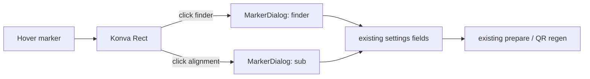

# Plan: Step 3 — marker hover targets + marker settings dialog

Status: **implemented** — marker hover targets, the reusable `MarkerDialog`, and the e2e/BDD journeys now exercise it.

## Goal

On **Adjust QR (step 3)**, hovering a QR finder/alignment marker reveals a translucent square over that marker. Clicking the square opens the relevant marker settings UI.

Keep the implementation deliberately small and reuse what the project already has:

- existing **Konva / react-konva** canvas and `Group` transforms;
- existing native **`<dialog>` pattern from `IconGallery`**;
- existing `settings` / `onSettings` / reducer / prepare pipeline;
- existing StyleX tokens and UI controls;
- existing marker schema and QR-generation behavior.

**No new third-party dependencies.**



## 1. Design decision

Use four Konva `Rect` hit targets inside the existing QR `Group` and one reusable HTML `MarkerDialog` component.

`Canvas` remains responsible only for canvas geometry and pointer interaction. It reports which marker kind was clicked. `PreviewPanel` owns dialog state and connects the dialog to the existing settings pipeline.

```text
Canvas.tsx
  └─ QR Group
      ├─ QR Image
      ├─ TL finder Rect
      ├─ TR finder Rect
      ├─ BL finder Rect
      └─ BR alignment Rect
           │
           └─ onMarkerClick('finder' | 'sub')

PreviewPanel.tsx
  ├─ Canvas
  ├─ PatternSettings
  └─ MarkerDialog
       ├─ kind="finder"
       └─ kind="sub"
```

Do **not** add:

- a marker geometry module;
- a dialog framework;
- a popover framework;
- a global/store field for dialog state;
- separate `FinderMarkerDialog` and `SubMarkerDialog` components;
- a new marker settings abstraction unless implementation proves it necessary.

## 2. Current behavior

- `StepAdjust.tsx` is only the step-3 sidebar; the QR itself is rendered by `Canvas.tsx`.
- `PreviewPanel` already places `Canvas` and `PatternSettings` together on step 3.
- The QR is already a draggable/rotatable Konva `Group`.
- `PatternSettings` currently contains ECC, pixel style, marker pixel style, marker shape, marker inner, sub marker, seed, and rim.
- `IconGallery` already establishes the project's native `<dialog>` behavior and styling.
- Finder markers are the three 7×7 blocks at TL / TR / BL.
- `markerSub` controls alignment markers.
- `Prepared.qrMetadata` already exposes `totalModules` and `version`.

No schema, QR engine, worker, reducer, or assembly changes are required.

## 3. Target behavior

### 3.1 Marker hit targets

Render hit targets inside the existing QR `Group`, after the QR image and before the placement border.

There are normally four targets:

| ID   | Kind   | Size        | Opens               |
| ---- | ------ | ----------- | ------------------- |
| `tl` | finder | 7×7 modules | Finder settings     |
| `tr` | finder | 7×7 modules | Finder settings     |
| `bl` | finder | 7×7 modules | Finder settings     |
| `br` | sub    | 5×5 modules | Sub-marker settings |

Version 1 has no alignment marker, so omit `br` there.

All finder targets edit the same existing finder settings. The bottom-right alignment target edits the existing `markerSub` setting. Other alignment patterns continue sharing `markerSub` and do not receive additional hit targets.

### 3.2 Geometry

Keep the geometry directly in `Canvas.tsx`; it is small enough that a new helper module would add more structure than value.

```ts
const pitch = placement.size / totalModules
const n = totalModules - 4
const q = 2

const markerHits = [
  {
    id: 'tl',
    kind: 'finder',
    x: q * pitch,
    y: q * pitch,
    size: 7 * pitch,
  },
  {
    id: 'tr',
    kind: 'finder',
    x: (q + n - 7) * pitch,
    y: q * pitch,
    size: 7 * pitch,
  },
  {
    id: 'bl',
    kind: 'finder',
    x: q * pitch,
    y: (q + n - 7) * pitch,
    size: 7 * pitch,
  },
  ...(version >= 2
    ? [
        {
          id: 'br',
          kind: 'sub',
          x: (q + n - 9) * pitch,
          y: (q + n - 9) * pitch,
          size: 5 * pitch,
        },
      ]
    : []),
]
```

The bottom-right alignment marker is the 5×5 alignment pattern centered at code-grid `(n - 7, n - 7)`.

Because the hit targets are children of the QR `Group`, Konva already handles translation, scale, resize, and rotation. Do not recreate those transforms with HTML overlays.

### 3.3 Hover appearance

Each target is a listening Konva `Rect`.

Use a very faint default fill so the controls remain discoverable on touch/no-hover devices, and increase the alpha on hover.

Suggested behavior:

- default: approximately `0.05–0.08` fill alpha;
- hovered: approximately `0.25–0.35` fill alpha plus a thin stroke;
- pointer cursor while hovering;
- only the hovered target gets the stronger highlight;
- clear hover when QR dragging starts.

Do not add a JS media-query hook solely to distinguish touch from mouse unless testing demonstrates it is needed.

Do not implement a checkerboard transparency pattern. The square is simply a translucent overlay.

### 3.4 Click behavior

`Canvas` exposes:

```ts
onMarkerClick?: (kind: 'finder' | 'sub') => void
```

Each hit `Rect` calls it from its existing Konva click/tap interaction.

Start with normal Konva click/drag behavior. Do **not** add custom pointer-distance or drag-suppression state unless testing shows that a drag incorrectly opens the dialog.

Use `e.cancelBubble = true` if necessary to prevent the marker click from triggering unrelated canvas interactions.

## 4. One reusable MarkerDialog

Add:

```text
src/components/editor/MarkerDialog.tsx
```

Props can stay small:

```ts
type MarkerDialogProps = {
  kind: 'finder' | 'sub' | null
  settings: EditorSettings
  onSettings: (patch: Partial<EditorSettings>) => void
  onClose: () => void
}
```

The component renders **one native `<dialog>`**. Its title and controls depend on `kind`.

### Finder mode

Title: **Finder marker**

Move these existing controls from `PatternSettings`:

- Marker pixel style: `square` / `rounded`
- Marker shape: `square` / `circle` / `octagon`
- Marker inner: `square` / `circle` / `plus` / `diamond`

Keep the existing accessible radiogroup names and existing mini previews.

### Sub mode

Title: **Sub marker**

Move the existing:

- Sub marker: `square` / `circle`

Keep the existing accessible radiogroup name and preview.

### Dialog implementation

Copy the project's established `IconGallery` contract instead of introducing a new abstraction:

- native `<dialog>`;
- `showModal()` / `close()` synchronization;
- `closedby="any"` where supported;
- Escape closes;
- Close button;
- backdrop click behavior matching `IconGallery`;
- StyleX `::backdrop` and existing tokens;
- `aria-labelledby`;
- no author `display` rule on `<dialog>`;
- no Apply/Save step.

Radio changes call `onSettings(...)` immediately. Closing the dialog keeps the latest settings because they already entered the normal editor state pipeline.

The component should be mounted as HTML in `PreviewPanel`, not inside Konva.

## 5. PreviewPanel ownership

`PreviewPanel` owns the temporary UI state:

```ts
const [markerDialog, setMarkerDialog] = useState<'finder' | 'sub' | null>(null)
```

Wire it as:

```tsx
<Canvas
  ...
  onMarkerClick={setMarkerDialog}
/>

<MarkerDialog
  kind={markerDialog}
  settings={settings}
  onSettings={onSettings}
  onClose={() => setMarkerDialog(null)}
/>
```

This keeps `Canvas` focused on geometry/input and keeps settings UI next to the existing `PatternSettings` ownership.

Do not put dialog-open state into the editor reducer; it is transient UI state.

## 6. PatternSettings

Remove the four marker-related fieldsets from `PatternSettings.tsx`:

- marker pixel style;
- marker shape;
- marker inner;
- sub marker.

Keep:

- ECC;
- pixel style;
- seed;
- rim.

Move the marker-specific mini-preview helpers together with the controls into `MarkerDialog.tsx` unless an existing helper is already shared elsewhere.

Do not create `marker-options.tsx` merely to split a small amount of JSX.

## 7. StepAdjust

No canvas or dialog logic belongs in `StepAdjust.tsx`.

Only update its hint, for example:

> Original poster pixels. Size snaps to whole QR modules. Drag or resize the QR in the preview, or rotate it with the handle. Hover a finder or alignment marker to edit it. Other pattern settings are beside the preview.

## 8. File changes

| File                                         | Change                                                                                     |
| -------------------------------------------- | ------------------------------------------------------------------------------------------ |
| `src/components/editor/Canvas.tsx`           | Inline marker geometry; render Konva hit `Rect`s; hover state; call `onMarkerClick(kind)`. |
| `src/components/editor/MarkerDialog.tsx`     | **New and only new component.** Native dialog reused for finder/sub settings.              |
| `src/components/editor/PreviewPanel.tsx`     | Own `markerDialog` state; wire Canvas → MarkerDialog; pass existing settings callbacks.    |
| `src/components/editor/PatternSettings.tsx`  | Remove marker controls; keep ECC / pixel / seed / rim.                                     |
| `src/components/editor/steps/StepAdjust.tsx` | Update hint only.                                                                          |
| schema / reducer / worker / engine / `qr.ts` | **No change.**                                                                             |

No new third-party package should be added to `package.json`.

## 9. Tests

Avoid creating tests solely to justify a new geometry abstraction; there is no geometry abstraction in this plan.

For this implementation pass:

```bash
pnpm test
pnpm typecheck
pnpm build
```

Do not update or run the editor Playwright journey unless requested, consistent with the existing project instructions.

The current e2e test that expects marker settings directly in Pattern Settings will eventually need to change to:

1. open the relevant marker dialog from the canvas;
2. use the same existing radiogroup names;
3. verify the same settings behavior.

Keeping those accessible names unchanged should make that later change mechanical.

If the project already has an inexpensive Canvas/component test harness, optionally cover:

- version 1 → 3 targets;
- version 2+ → 4 targets;
- finder click → `finder`;
- BR click → `sub`.

Do not introduce a new testing framework or Canvas harness just for this feature.

## 10. Implementation gates

The feature is complete when:

1. Step 3 displays TL/TR/BL finder hit areas and BR alignment hit area when available.
2. Hovering clearly highlights the target without altering the QR itself.
3. Finder click opens Finder marker controls.
4. BR alignment click opens Sub marker controls.
5. Changing a radio immediately regenerates the QR through the existing settings pipeline.
6. QR move/resize/rotation keeps the hit targets aligned automatically through the existing Konva Group.
7. Marker controls no longer appear in Pattern Settings.
8. Version 1 does not render a fake alignment target.
9. `pnpm test`, `pnpm typecheck`, and `pnpm build` pass.
10. No new dependency is added.

## 11. Out of scope

- Per-finder styles.
- Hit targets for every alignment pattern.
- New marker schema or QR rendering semantics.
- Moving ECC, pixel style, seed, or rim into the marker dialog.
- Keyboard navigation of individual Konva marker targets.
- A new generic modal/dialog framework.
- HTML overlays synchronized to Konva transforms.
- New reducer/store fields for dialog state.
- Custom click-vs-drag machinery unless an actual bug requires it.
