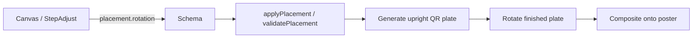

# Plan: Step 3 — QR rotation (arbitrary angle)

Status: **implemented** — schema, validation, assembly, canvas, and tests all landed.

Implements rotation for the QR placement in `src/components/editor/Canvas.tsx` / step 3 without making the QR generator itself rotation-aware.

The core design is:

> Generate the complete QR plate upright exactly as today, then treat rotation as a placement/compositing transform of that finished plate.

This replaces the earlier quarter-turn design. Rotation is no longer limited to `0 | 90 | 180 | 270`, and the engine does not rotate QR modules, finder origins, or texture geometry independently.

## 1. Decision: rotate the finished QR plate

The QR generator remains completely unaware of rotation.

The existing pipeline still creates an upright square QR plate containing the normalized QR, finder/light-band treatment, rim, and decorative texture. Rotation is applied only after that plate exists.



### Why

| Option                                                        | Verdict    | Why                                                                                                                                  |
| ------------------------------------------------------------- | ---------- | ------------------------------------------------------------------------------------------------------------------------------------ |
| Rotate QR modules / finder geometry individually              | **Reject** | Makes the QR engine understand rotation and requires special finder-origin and lattice logic.                                        |
| Restrict engine to quarter turns                              | **Reject** | Unnecessary product limitation; QR rotation itself is not restricted to 90°.                                                         |
| Rotate an already encoded PNG repeatedly                      | **Reject** | Adds unnecessary decode/resample/encode passes and can accumulate raster degradation.                                                |
| **Generate one upright plate, then rotate/composite it once** | **Adopt**  | Keeps QR generation unchanged, isolates rotation to placement/rendering, supports arbitrary angles, and minimizes special-case code. |

Rotation is therefore a property of **placement**, not QR generation or pattern settings.

The stored angle is any finite number of degrees, canonicalized to `[0, 360)`. Default is `0`. Do **not** implement a 45° snap, a 45° step, or any other default increment. The first UI is free rotation via the Konva handle; a later snap policy can be added without changing the engine contract.

## 2. Current behavior

- `placementSchema` is `{ x, y, size }` (`src/lib/editor/schema.ts`).
- `canonicalPlacement` snaps `x/y` to integers ≥ 0 and `size` to a whole-module multiple.
- `QrPlacement` / `QrBoxInput` (`src/core/types.ts`, `src/core/placement.ts`) have no rotation.
- Auto-place and manual validation operate on an axis-aligned square.
- `EditorCanvas` (`src/components/editor/Canvas.tsx`) uses a Konva `Group` as the drag/resize target at placement `x/y`.
- `Transformer` currently has `rotateEnabled={false}`.
- `onTransformEnd` commits `{ x, y, size }` and drops additional placement fields.
- `toPreparedPayload` / `PreparedPayload.placement` duplicate `{ x, y, size }`.
- Assembly builds the QR plate upright and copies it into an axis-aligned placement.
- `fitsMask` assumes the placed square is axis-aligned.
- `qrPixels` currently assumes a 1:1 source-to-poster pixel mapping.
- Step 3 supports drag, resize, nudge, and keyboard movement, but no rotation.

## 3. Target behavior

### 3.1 Product

On step 3 the user can rotate the complete QR plate.

- Default `rotation = 0`.
- Rotation travels with `x/y/size` as part of placement.
- The first UI is free rotation: no 45° snap, no 45° step buttons, no `rotationSnaps`.
- The underlying placement accepts arbitrary finite angles.
- Dragging and resizing preserve rotation.
- A content / ECC change that recentres the QR preserves rotation.
- Auto-place emits `rotation = 0`.
- Invalid placement is flagged; rotation must never silently move the QR to make it valid.
- Rotation-only changes do not regenerate/re-decode the source QR.
- Download is produced from the final assembly path; do not rotate an exported PNG as a second post-processing step.

### 3.2 Rotation semantics

`x`, `y`, and `size` continue to describe the **unrotated square** to minimize changes to the existing editor contract.

`rotation` is clockwise degrees around that square's centre.

```ts
interface Placement {
  x: number
  y: number
  size: number
  rotation: number
}
```

Centre:

```ts
const cx = placement.x + placement.size / 2
const cy = placement.y + placement.size / 2
```

The visual and assembly transforms must use the same centre and angle.

### 3.3 No snap in this change

Do not add a rotation snap interval.

- No `ROTATION_SNAP = 45`.
- No `snapRotation()` helper.
- No Konva `rotationSnaps` / `rotationSnapTolerance`.
- No ±45° footer buttons or `r` / `Shift+r` 45° steps.

Preferred interaction:

- Transformer rotation is enabled.
- The user rotates freely while dragging the handle.
- On commit, store `canonicalizeRotation(node.rotation())` — the live angle, not a rounded multiple.
- Keyboard already moves the QR; do not steal `r` for a discrete rotate step in this change.

A snap policy (45°, 15°, 90°, …) is out of scope and must not be encoded in the schema. If it is added later, it belongs only in the canvas UI.

## 4. Data model

### 4.1 Editor schema

Do not encode UI snap choices into the schema. There is no snap in this change.

```ts
export const rotationSchema = z.number().finite().default(0)

export const placementSchema = z
  .object({
    x: z.number().int().nonnegative(),
    y: z.number().int().nonnegative(),
    size: z.number().int().positive(),
    rotation: rotationSchema,
  })
  .strict()
```

Canonicalize rotation to `[0, 360)`:

```ts
export function canonicalizeRotation(deg: number): number {
  if (!Number.isFinite(deg)) {
    return 0
  }

  const normalized = deg % 360
  return normalized < 0 ? normalized + 360 : normalized
}
```

`canonicalPlacement`:

```ts
return {
  x: Math.max(0, Math.round(box.x)),
  y: Math.max(0, Math.round(box.y)),
  size: Math.max(4, Math.round(box.size / totalModules)) * totalModules,
  rotation: canonicalizeRotation(box.rotation ?? 0),
}
```

Do **not** round rotation to 45° here.

### 4.2 Core types

- `QrBoxInput` gains `rotation?: number`.
- `QrPlacement` has `rotation: number`.
- `PreparedPayload.placement` becomes `Placement` rather than restating `{ x, y, size }`.
- `toPreparedPayload`, `applyPlacement`, drag, resize, nudge, and recenter paths preserve rotation.
- Auto-place sets rotation to `0`.

### 4.3 Report

Keep the current schema version if the report format is intentionally additive and readers ignore unknown placement fields.

Emit:

```ts
placement: {
  x,
  y,
  size,
  rotation,
}
```

Rotation belongs on placement, not settings.

If any existing report consumer validates `placement` strictly, bump the schema instead of assuming additive compatibility.

## 5. QR generation stays unchanged

This is the main simplification.

Do **not** add:

- `QuarterTurn`
- `rotateRgbaSquare`
- `rotateFinderOrigins`
- rotation-aware `markerBandRects`
- rotated QR source offsets
- special 90° finder-corner mappings

The existing upright QR generation remains the single source of truth.

The complete upright plate should contain everything that visually belongs to the QR placement:

- normalized QR pixels;
- finder/light-band treatment;
- rim / safe modules;
- decorative texture associated with the QR plate.

After that plate is complete, placement code treats it as one square image.

## 6. Geometry and validation

This is the main core change required by arbitrary rotation.

The old assumption:

> `fitsMask({ x, y, size })` is sufficient because the QR occupies an axis-aligned square.

is no longer valid.

At 45°, a square's axis-aligned bounding box can reach approximately `size * sqrt(2)`.

### 6.1 Rotated corners

Add a pure geometry helper:

```ts
export interface Point {
  x: number
  y: number
}

export function rotatedSquareCorners(placement: Placement): readonly [Point, Point, Point, Point]
```

Implementation concept:

1. Build the four unrotated corners.
2. Rotate each around the placement centre.
3. Return them in consistent clockwise order.

Use normal `sin/cos`; do not special-case 45° or quarter turns.

### 6.2 Mask containment

Validation must test the **actual rotated plate footprint**, not only its AABB.

Do not accept a placement merely because the rotated AABB is inside the mask; irregular masks can still cut through the rotated square.

Reuse existing mask/image primitives where possible.

Preferred validation:

1. Compute the rotated plate's clipped raster bounds.
2. Iterate only pixels/modules covered by the rotated square.
3. Map destination samples back into plate-local coordinates with the inverse transform.
4. Any covered destination pixel outside the allowed mask makes the placement invalid.

The same transform helper should be shared by validation and assembly where practical so preview/validation/assembly do not disagree about the footprint.

Do not introduce polygon libraries unless the existing codebase already has one that materially simplifies this.

### 6.3 Auto-place

Keep auto-place simple:

- Auto-place searches only upright placements.
- Returned placement has `rotation: 0`.
- After the user rotates it, normal validation applies.

Do not make auto-place search angle space in this change.

## 7. Canvas implementation

### 7.1 Rotate the complete Group

The preview should rotate the same conceptual object that assembly rotates.

Prefer the complete QR plate as one Konva group/image rather than rotating only the inner QR image.

Use the placement centre as the transform origin:

```tsx
<Group
  x={placement.x + placement.size / 2}
  y={placement.y + placement.size / 2}
  offsetX={placement.size / 2}
  offsetY={placement.size / 2}
  width={placement.size}
  height={placement.size}
  rotation={placement.rotation}
>
  {/* complete upright QR plate preview */}
</Group>
```

The exact child structure can stay aligned with the existing implementation; the important invariant is that QR content, bands, rim, texture, border/hit target that represent the plate rotate together.

Do not rotate the poster/mask.

### 7.2 Transformer

Enable the existing Konva rotation handle instead of building custom pointer rotation.

Do **not** set `rotationSnaps` or `rotationSnapTolerance`. Free rotation only:

```tsx
<Transformer rotateEnabled />
```

Keep resize behavior compatible with the existing whole-module size snapping.

On transform commit:

- convert Konva's live transform back to canonical `{ x, y, size, rotation }`;
- reset transient scale as today;
- preserve centre/top-left semantics correctly;
- normalize rotation with `canonicalizeRotation`.

Do not store arbitrary Konva offsets/scales in placement.

### 7.3 Commit paths

Every placement mutation must preserve rotation:

```ts
// drag
{ ...placement, x, y }

// resize
{ ...placement, x, y, size }

// nudge
{ ...placement, x, y }

// rotate
{ ...placement, rotation }
```

Audit all places currently constructing `{ x, y, size }` from scratch.

### 7.4 Buttons and keyboard

Do not add discrete rotate buttons or keyboard rotate steps in this change. The Transformer handle is the rotation UI.

Nudge buttons and arrow keys stay translation-only.

### 7.5 StepAdjust copy

Suggested hint:

> Original poster pixels. Size snaps to whole QR modules. Drag or resize the QR in the preview, or rotate it with the handle.

Footer copy:

> Drag, resize, or rotate the QR.

## 8. Assembly

### 8.1 Build the plate upright first

Keep existing QR/pattern assembly logic responsible for producing the complete upright square plate.

Conceptually:

```text
QR source
   +
finder/light bands
   +
rim / texture
   ↓
upright RGBA plate
```

No rotation-specific logic belongs inside those steps.

### 8.2 Rotate/composite once

Add one transform/composite operation after the plate exists:

```text
upright RGBA plate
        ↓
inverse-mapped rotation around centre
        ↓
poster composite
```

Avoid:

```text
encode PNG
→ decode PNG
→ rotate
→ encode PNG
```

Operate on the in-memory RGBA buffer.

### 8.3 Sampling

Arbitrary raster rotation requires a sampling decision.

For QR reliability, default to **nearest-neighbour sampling** for the plate transform unless existing browser/engine tests show another method is required.

Reasons:

- avoids introducing grey anti-aliased QR module edges;
- preserves hard binary boundaries as much as possible;
- keeps the implementation deterministic;
- matches the QR/pixel-art nature of the asset.

The preview should disable image smoothing where applicable so it visually approximates the final compositor.

If the project already has a tested image-transform primitive that supports nearest-neighbour rotation, reuse it instead of writing a second resampler.

### 8.4 Shared transform math

Prefer one pure inverse-transform helper:

```ts
export function posterToPlatePoint(posterX: number, posterY: number, placement: Placement): Point
```

Assembly can iterate the rotated plate's AABB, inverse-map each destination pixel into plate coordinates, and copy a nearest source pixel when the local point lies inside `[0, size) × [0, size)`.

Validation can reuse the same footprint/mapping rules.

This avoids separate geometry implementations drifting apart.

## 9. Invariants

### Still true

1. QR generation itself is upright and deterministic.
2. `rotation = 0` follows the current assembly path and should remain bit-identical.
3. Auto-place behavior is unchanged apart from emitting `rotation: 0`.
4. Rotation is placement state, not QR/pattern settings.
5. No server render, CLI, temp files, or base64 are introduced.
6. Rotation-only edits do not regenerate the source QR.
7. The final download comes from the normal assembly output.

### Changed

The old global invariant:

> every final QR plate pixel is bit-exact with the upright source at the same `x/y` offset

only makes sense for the unrotated 1:1 path.

For `rotation = 0`, keep the existing `qrPixels` bit-exact assertion.

For rotated output, replace that assumption with transform-aware verification. Do not pretend arbitrary-angle rasterization is a 1:1 source-offset copy.

At minimum verify:

- every written plate pixel comes from the upright plate according to the documented nearest-neighbour inverse transform;
- pixels outside the transformed footprint are untouched;
- the assembly qualifies under the existing non-pixel-equality checks.

Decode-verifying the final QR can remain out of scope unless the project already has a decoder suitable for a cheap test gate.

## 10. Tests

| Area                                 | Cases                                                                                                                                        |
| ------------------------------------ | -------------------------------------------------------------------------------------------------------------------------------------------- |
| `canonicalizeRotation`               | omitted → 0; `-45` → 315; `360` → 0; `405` → 45; `12.5` stays `12.5`; arbitrary finite angles preserved modulo 360. Do **not** round to 45°. |
| `canonicalPlacement`                 | preserves arbitrary rotation (including non-multiples of 45°) while snapping x/y/size.                                                       |
| rotated corners                      | 0°, ~30°, 45°, 90° known fixtures; centre remains fixed. 45° is a geometry stress case (largest AABB), not a UI snap.                        |
| footprint / inverse transform        | inside/outside samples around 0°, 45°, 90° boundaries.                                                                                       |
| `fitsMask`                           | rotated square accepted when fully inside; rejected when a rotated corner/edge crosses the mask; irregular-mask regression.                  |
| auto-place                           | emits `rotation: 0`.                                                                                                                         |
| `applyPlacement`                     | recenter/QR module-count changes preserve rotation.                                                                                          |
| Canvas commit                        | drag/resize preserve rotation; rotation commit stores the live angle, not a snapped multiple.                                                |
| Assembly 0°                          | remains bit-identical to the current golden path.                                                                                            |
| Assembly non-zero (e.g. 30° and 45°) | qualified; only transformed footprint changes; nearest-neighbour mapping matches helper.                                                     |
| Assembly 90°                         | qualified and consistent with the generic rotation path; no special quarter-turn implementation required.                                    |
| Cache                                | rotation-only prepare does not re-decode/regenerate QR source.                                                                               |
| Report                               | emitted placement contains canonical rotation.                                                                                               |

Do not add Playwright/e2e in this change unless requested by `AGENTS.md` / maintainer policy.

If e2e is added later, cover:

- rotate handle (free angle, no snap);
- invalid rotated placement;
- assemble/download after rotation.

## 11. Docs

With implementation:

- `README.md` step 3: mention the rotation handle and that the angle is free (default 0).
- `doc/plan/web-qr-poster.md`: remove the old “unrotated” constraint and rotation exclusion.
- Document that QR generation stays upright and rotation is applied to the complete plate during placement/compositing.
- Mark this plan implemented when all gates pass.

`doc/plan/artistic-qr-poster.md` remains historical.

## 12. Sequenced implementation and gates

### 1. Placement schema

- Add `rotation`.
- Add `canonicalizeRotation`.
- Thread rotation through `Placement`, `QrBoxInput`, `QrPlacement`, prepared payload, reports, and mutation paths.
- Auto-place emits `0`.

Gate:

- existing tests pass with implicit/default `0`;
- new rotation canonicalization tests pass;
- typecheck passes.

### 2. Shared rotated geometry

- Add centre/corner helpers.
- Add inverse placement transform.
- Update `fitsMask` / validation to use the rotated footprint.
- Keep auto-place upright.

Gate:

- 0° validation matches current behavior;
- rotated containment fixtures pass (include 45° as the max-AABB case, plus a non-45° angle);
- irregular-mask regression passes.

### 3. Assembly transform

- Keep upright plate generation unchanged.
- Rotate/composite the completed in-memory RGBA plate with the shared transform.
- Use nearest-neighbour sampling.
- Preserve the existing fast/bit-exact 0° path.

Gate:

- current 0° golden fixture remains bit-identical;
- at least one non-zero free angle (not limited to 45°) and 90° assemblies qualify;
- `pnpm test` + `pnpm typecheck`.

### 4. Canvas + StepAdjust

- Rotate the complete QR placement Group.
- Enable Konva rotate handle with **no** `rotationSnaps`.
- Do not add 45° (or any other) snap points, rotate-step buttons, or `r` / `Shift+r`.
- Preserve rotation on drag/resize/recenter.
- Update copy.

Gate:

- `pnpm typecheck`;
- `pnpm build`;
- manual browser check of drag → resize → rotate → invalid state → assemble → download.

Do not run e2e unless requested.

### 5. Docs

- Update README and `web-qr-poster.md`.
- Mark this plan implemented after all gates pass.

## 13. Out of scope

- 45° (or any other) default snap / step rotation.
- Rotating the poster or mask.
- Rotating QR internals independently.
- Rotation-aware auto-place angle search.
- Perspective/skew transforms.
- Non-uniform scaling.
- Persisted projects / URL state if the editor does not already support them.
- Repeated post-export image rotation.
- Adding a new image-processing dependency solely for rotation unless existing primitives cannot implement the required transform cleanly.
- Final assembled-QR decode verification unless explicitly requested.

## 14. Implementation principle

Rotation should remain a generic placement transform.

The QR generator should answer:

> What does the complete upright QR plate look like?

Placement/compositing should answer:

> Where, at what size, and at what angle is that plate placed on the poster?

Keeping those responsibilities separate allows free rotation now, and a UI snap policy later, without redesigning QR generation again. Do not ship a 45° default snap in this change.
