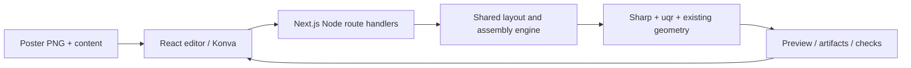

# Web QR poster editor

Status: implemented; the web editor is the supported product interface and the CLI has been retired (see step 6). This document is the design record. The server-rendering parts (Node route handlers, `src/server/`, multipart requests, base64 artifact transport, the `BUSY` gate) have been superseded by the client-side pipeline described in `README.md` and `AGENTS.md` — keep reading them as design history, not as the shipped architecture.

The shipped editor can also export a self-contained `mahu-qr.recipe.json` after assembly. A separately deployed Cloudflare Worker at `POST /v1/render` validates and replays that recipe through the shared renderer; editor assembly remains local. The recipe's embedded PNGs are the deliberate exception to the earlier ban on base64 transport. See the portable recipe section in `README.md` and the runtime constraints in `AGENTS.md`.

## Product goal

The editor is branded **mahu-QR** (码码虎虎). The head-only mascot `public/brand/mahu-tiger.svg` drives the visual identity: near-black `#101211` and vermilion `#ff321e` on warm cream, layered onto the existing Wired-Elements sketch geometry and Gloria Hallelujah handwriting UI, with hard offset shadows. It appears in the header lockup with **Mahu QR** beneath it, the empty-state preview, the favicon (`src/app/icon.svg`), the touch icon, and the social image. Pattern colors can be customized with the per-row suggestions; `DEFAULT_PALETTE` and every engine output stay unchanged.

Error correction uses a four-stop slider for L, M, Q, and H, with approximate recovery percentages shown at each stop. Pixel-style cards preview QR styling encoded from an empty text value, so the options remain visible and comparable before content is entered.

## Reactive workspace (implemented 2026-09-22; content inputs and mobile panels updated 2026-09-24; mask Auto fill added 2026-09-25)

The shipped editor no longer uses the four-step navigation model. Its header offers URL, Text, Phone, WiFi, SMS, Email, and QRCode inputs. URL, Text, and Phone use a single field; WiFi, SMS, Email, and QRCode use a native dialog. On mobile, the header sticks to the viewport top with the Home logo at left and an input-styled content button at right. Opening it reveals the same form in an absolutely positioned Motion panel below the bar; the panel overlays the preview without shifting it. **Slide up** or Escape closes it with focus returned to the button. The reveal follows reduced-motion preferences. The disclosure is transient UI state and does not commit content or start preparation by itself. Structured entries serialize into one-line QR content and update the preview after a short debounce; form submission commits immediately. QRCode accepts a PNG, decodes its text in the browser, then generates the preview through the existing worker. The committed value drives automatic mask derivation and reusable worker assets. The SVG preview keeps an upright QR image and current placement visible even when exact containment fails. A persistent toolbar sits above the preview canvas throughout editing, with **Fill region**, **Auto fill**, **Add Rim**, and **Add Margin** available in both editing views. The canvas scales to the remaining viewport height so placement guidance and controls stay in view without an internal preview scrollbar. The selected region remains highlighted in the preview. **Fill region** mode accepts one click in an enclosed source-mask area at a time and shows instructions until it exits. **Auto fill** fills every enclosed unselected area from the source mask in one operation, including holes beneath the placed QR; it reports when no holes are present. Both actions use the source mask rather than the rendered overlay or poster, and the updated mask refreshes source assets without repositioning the QR. Escape exits Fill region mode. Non-empty values derive a letter in the Fathead font, and plain text uses its first ASCII letter or digit. Assembly requires valid input and is the explicit boundary for exact placement validation and final rendering.

Desktop renders persistent Mask selection, Preview canvas, and Pattern settings columns, with both side panels aligned to the preview canvas top. At the mobile breakpoint, fixed vertical **Mask selection** and **Pattern settings** buttons sit on opposite viewport edges. Each opens its existing panel as a full-width, full-height native modal that slides in from that side with Motion. The labeled close icon and Escape close the surface after its exit animation, and focus returns to the opening button. The modal keeps the page behind it inert, respects reduced motion, and scrolls its own content within the safe-area padded small viewport. The controls are hidden in the assembled-result view. The same panel instances and state survive breakpoint changes. There is no separate mask preview in the mask panel; the preview toolbar shares separate Fill region and Add Rim actions between region-only and QR views, sits above the canvas, and follows the preview in document flow. Selecting mask text/font/blank/icon or uploading a valid custom PNG switches from automatic mask selection to a manual choice that remains fixed as content changes. The custom mask dropzone sits at the bottom of Mask selection, accepts one local PNG up to 10 MiB, checks the PNG header, poster dimensions, and presence of selected opaque white pixels before committing, and leaves the active mask untouched on rejection. The worker repeats its authoritative mask validation during preparation. After a commit, pattern settings and placement edits refresh the preview without a Continue or completion Generate step. Full-resolution assembly/download remains an export action and renderer invariants are unchanged.

On desktop, keyboard navigation starts with the Home link, then the simple URL/Text/Phone field, content-type choices, and examples; structured content types place **Edit details** first. On mobile, the Home link and content disclosure button come first, followed by the fixed Mask selection and Pattern settings controls; opening the disclosure focuses the actual content field or structured-content details control. Editor controls share a 3px dotted vermilion `:focus-visible` outline with a 3px offset. Keyboard-focused pixel-style and marker-shape radios outline their visible card, and SVG marker targets show the dotted indicator at the marker. Native dialogs and mobile panels contain Tab and Shift+Tab, dismiss with Escape or their labeled close icon, and restore focus to their opener.

Readable editor text uses `rem` sizing so browser default font preferences enlarge labels, hints, headings, and controls. The desktop track adjustment and mobile panel transition use matching `em` thresholds in StyleX and `matchMedia`; the mask, icon-gallery, and pattern grids reduce columns as their available width contracts. The mask search target grows with the user's text setting, and the header mascot clamps to the viewport width. The SVG scene maps pointer coordinates through its viewBox transform and keeps geometry in poster pixels. Display scaling ends at that boundary; it never changes placement units or exported bytes.

Editor validation errors, worker preparation and assembly failures, icon-search failures, fill outcomes, and rejected palette choices are presented through one viewport-level React-Toastify container. On mobile, its host moves to the bottom of the pattern-settings dialog while that panel is open, keeping notifications visible without covering its close icon. Palette errors list affected colors after a commit attempt and leave invalid values pending for correction; live picker movement does not emit repeated errors. Toasts do not change the canvas layout; document and placement errors remain authoritative in editor state after a toast is dismissed. Worker errors offer a retry for the failed action, while invalid placement stays editable and blocks assembly. Preview refresh progress remains available through existing busy controls and `aria-busy` without inserting a banner above the canvas.

### Editor state migration (implemented 2026-09-22)

Each mounted editor now creates one vanilla Zustand store through `EditorStoreProvider`. The store owns document/revision transitions, draft validation, source Files, mask selection, icon-search state, and panel state; derived readiness and error values live in pure selectors. The pure reducer remains the revision/stale-completion boundary. Worker handles, timers, async tokens, DOM/canvas refs, and Blob URLs remain runtime-local, and the owned worker is disposed on unmount so a remounted editor can safely restart at revision zero. Zundo retains up to 50 previous dated state snapshots plus the current one in memory for read-only tracing; Files, Blobs, and icon payloads are omitted. There is no persistence, URL synchronization, external logging, or undo/redo UI.

Upload a PNG poster containing a solid black region, choose the QR content type, move and resize the QR on the poster, then assemble and download the finished PNG. Use the existing deterministic assembly style: rounded decorative QR cells inside the black region and the real QR at the selected position.

The black region is part of the uploaded poster, not a second required file. Detect it automatically and show a translucent selection overlay before assembly. Preserve the original poster dimensions and all pixels outside the selected region.

### First release

1. **Content:** accept one nonblank line through URL, Text, or Phone; offer WiFi, SMS, Email, and QRCode in structured dialogs. URL is an absolute HTTP(S) URI and is never fetched. Phone is encoded as a `tel:` URI; WiFi uses escaped `WIFI:` content with WEP or WPA/WPA2; SMS uses `SMSTO:`; Email uses a percent-encoded `mailto:` URI. Decode uploaded single-frame PNG QR codes locally and use the decoded one-line text as input to the normal QR generator. Close the QRCode dialog after a valid upload; keep it open with an error for an invalid upload. Keep incomplete forms and unsupported uploads from replacing the current preview. Apply the shared one-line and QR-capacity checks before committing.
2. **Mask selection:** the mask comes from a 10-character search field (`TEXT_MASK_MAX_LENGTH=10`) whose first character drives the letter tiles (including **blank** for full canvas, fonts in `public/fonts` white on black at full poster height; see `public/fonts/ATTRIBUTION.md`). Generated font masks are centered by the bounding box of their rendered selected pixels, after fitting the glyph to the poster; blank, icon, and custom masks keep their own rendering paths. The fixed 3×4 grid stays the twelve bundled font tiles and keeps the first-letter rule; icons are searched from the single combined control below the grid. `IconGallery` owns the native search dialog and caches only the latest term. Clicking any tile draws its white-on-black mask on the fixed 1000×1000 canvas (letters via `drawTextMask`, icons via `drawIconMask` recolored to white and scaled to fill 80% while preserving aspect). At the bottom of Mask selection, `react-dropzone` accepts one custom PNG up to 10 MiB; the file must match poster dimensions and contain an opaque white selected pixel. Rejected uploads preserve the current mask. Automatic selection follows committed content until the user chooses a font, blank, icon, or custom mask; that manual choice remains fixed as content changes.
3. **Position:** prepare reusable poster, mask-highlight, and upright QR preview assets. Show them in a responsive SVG scene and let users drag, uniformly resize, rotate, nudge with arrow keys/touch controls, and adjust size/angle from the keyboard. **Best position** centers the current-size QR in the largest square found fully inside the selected region, using the region-centroid placement logic, and preserves size and rotation. When no minimum-size inset square fits, it centers the QR on the selected region's centroid. Keep the button available; a no-op click does not create a document revision. Dragging follows poster coordinates at all preview fit sizes. The resize handle scales continuously along the QR's local diagonal, holding the opposite local corner; Alt holds the centre. At pointer-up, the preview settles briefly to the nearest valid whole-module size and commits one canonical placement. Escape, pointer cancellation, or window blur cancels without a placement commit. Gesture motion stays local; placement edits never schedule preparation, mask scans, or fit validation. Keep any placement visible and editable, including negative/off-canvas and region-invalid placements. Show a neutral selection outline and the caption “Assemble to check placement and render the final poster.” Assembly checks containment, safe modules, rotated-frame coverage, texture room, and mandatory pixel invariants; failure reports through the toast surface and leaves the placement unchanged. A content or error-correction change that alters module count recentres the current box around its previous centre without clamping. Rotate the complete upright plate once during compositing with nearest-neighbour sampling; QR generation stays rotation-unaware.
4. **Assemble:** render the full-resolution result from the current content, placement, and seed. Display progress, show the result, and let users return to editing. Also derive a self-contained `poster.svg` whose full-poster image embeds the exact verified original PNG; it is image-backed because uploaded artwork is raster. Changing document inputs makes the previous result stale and disables its download until reassembled.
5. **Download:** offer the original `poster.png`, `poster.svg`, the smallest verified raster size with a 4px minimum module pitch, and distinct 320px, 640px, and 1280px bounding-box tiers below the original. Preserve aspect ratio and integer module pitch. Reassemble each smaller choice in the worker from an area-resampled source and conservative region mask, then require its own placement and mandatory pixel verification; show its exact dimensions, module pitch, and encoded bytes. Keep the active PNG preview and download on the same Blob. Put the QR PNG, transparent cut PNG, cut SVG, mask PNG, and verification report behind an optional details section. No account is required.

Keep the seed stable internally across edits, along with pixel style (`square`, `rounded`, `dot`, defaulting to `dot`), a fixed 1-module finder margin, an optional one-module margin along the selected region, plate corner treatment, rim thickness 0–5, and rounded rim (antialiased), plus the pattern colors: a `pixel / marker / background` palette (defaults black/black/white) shown as one row of pickr swatches; changing the pixel color derives marker and background colors until those colors are customized. A contrast guard blocks unscannable palettes before they commit. The preview toolbar presents **Fill region**, **Auto fill**, **Add Rim**, and **Add Margin** in both editing views, above the canvas without pinning or internal preview scrolling. Fill mode accepts single clicks in enclosed source-mask areas; Auto fill detects all unselected components that cannot reach the canvas edge through four-connected unselected pixels and fills them in one source-mask edit. Auto fill runs in chunks with browser yields for large masks, uses the same mask threshold and edge overlap as click fill, and requires no new image-processing dependency or worker. **Add Margin** paints the region's outer safe-module ring with the finder marker's light background pixels and defaults off; when Rim is also on, its dark rings start immediately inside the light margin. Marker styling lives in small dialogs opened from hovered/found markers on the canvas: each of the three 7×7 finder markers has its own pixel style (`square`/`rounded`), outer shape (`square`/`circle`/`octagon`/`squircle`), and inner shape (`square`/`circle`/`plus`/`diamond`/`squircle`); its dialog includes **Apply to all finder markers** to copy that full configuration to the other two. Squircle uses a shared fourth-power superellipse path for its dark outer and light inset contours and for the 3×3 inner shape. The bottom-right 5×5 alignment marker (version ≥ 2 only) keeps a separate dialog (`square`/`circle`). Do not present the old numeric cut-radius control as general silhouette rounding: in assembly it only chooses the marker-corner treatment. Step 1 offers example QR buttons for quick content selection.

Excluded from this migration: paid Qwen generation, standalone pattern-preview/pattern-cut tools, freehand mask painting, text printed on the poster, multiple QRs, accounts, saved projects, and a template marketplace.

## Dependency choices

Prefer established packages and framework/browser primitives for general functionality. The choices below prioritize ecosystem adoption and suitability; they are not a claim of a measured download ranking. Select mutually compatible stable versions at implementation time and commit the pnpm lockfile.

| Responsibility                                 | Choice                                                                                    | Why / boundary                                                                                                                                                                                                                                                                                                                                     |
| ---------------------------------------------- | ----------------------------------------------------------------------------------------- | -------------------------------------------------------------------------------------------------------------------------------------------------------------------------------------------------------------------------------------------------------------------------------------------------------------------------------------------------- |
| Web application and HTTP endpoints             | Next.js App Router, React, TypeScript                                                     | One application for the editor and Node rendering endpoints; no separate API framework. [Route Handlers](https://nextjs.org/docs/app/api-reference/file-conventions/route) support standard Request/Response and multipart form data. _(Superseded: the render endpoints were removed in the client render migration; only `/api/icons` remains.)_ |
| Canvas interactions                            | Native SVG and pointer events                                                             | Reuse the upright QR preview in one scalable SVG scene; keep transient gestures local and commit canonical poster-pixel placement once at gesture end.                                                                                                                                                                                             |
| Image decoding, compositing, PNG/SVG rendering | Existing `sharp`                                                                          | Retain the current server renderer and raw-pixel checks. Configure its documented [input pixel limit](https://sharp.pixelplumbing.com/api-constructor/). _(Superseded: sharp is dev-only as the Node test backend behind the imaging seam; the browser uses `@jsquash/png` + `@resvg/resvg-wasm`.)_                                                |
| QR encoding and module classification          | Existing `uqr`                                                                            | [Its encoder](https://github.com/unjs/uqr) exposes the matrix and cell types required by marker removal. Keep it even though generic QR widgets are more common; switching would jeopardize style and module parity.                                                                                                                               |
| QR verification                                | Existing `@zxing/library` and `jsqr`                                                      | Retain the tested decoder chain. No custom decoder.                                                                                                                                                                                                                                                                                                |
| Request and form validation                    | `zod`                                                                                     | Shared [runtime schemas](https://zod.dev/) and inferred types; PNG, content, and placement checks run in the client-owned worker.                                                                                                                                                                                                                  |
| Tests                                          | Existing Vitest + Playwright                                                              | Preserve pixel/geometry tests; add [browser workflow tests](https://playwright.dev/docs/intro) for upload, editing, and download.                                                                                                                                                                                                                  |
| Simple UI state, uploads, downloads            | Editor-scoped Zustand store, native form controls, Fetch, File/Blob references, Blob URLs | One vanilla store per mounted editor; runtime handles and object URLs remain outside observable state.                                                                                                                                                                                                                                             |
| Component styling                              | StyleX (`@stylexjs/stylex`, Babel + PostCSS plugins)                                      | [Compile-time atomic CSS](https://stylexjs.com) with a typed token layer and layer-based cascade instead of one hand-maintained global stylesheet; no runtime style injection.                                                                                                                                                                     |

Reuse the project-specific detector, safe-module calculation, phase locking, four-module rim, plate geometry, seeded pattern logic, and rounded cell geometry. These are the product's existing algorithms. Do not reimplement PNG codecs, QR encoding, canvas manipulation, multipart parsing, or validation libraries. Do not add a tracing library for assembly: its boundary consists of whole modules, not a traced silhouette.

## Architecture

**Superseded:** the shipped architecture is browser-only: `prepareEditor`/`assembleFromBuffers` orchestration lives in `src/lib/editor/engine/`, runs in a Web Worker, and has no server render API. What follows is the original server-rendering design.

Use a browser editor plus a Node server. Sharp, filesystem APIs, and Buffer-dependent rendering stay in server-only modules. The browser owns interaction state and displays server-rendered images; final export always comes from the shared assembly engine. This preserves the current renderer without a browser/WASM rewrite.



### Separate computation from file I/O first

`src/layout.ts` currently reads paths, and `src/assemble.ts` both computes the result and writes artifacts. Extract buffer-based services before building the UI:

- `prepareEditor({ posterBytes, content, maskBytes? })` returns dimensions, detected mask preview, QR image/metadata, and an assembly-valid initial placement.
- `validatePlacement({ regionMask, qrMetadata, placement, settings })` checks fit, safe cells, remaining texture, and pattern crop feasibility. Share pure coordinate rules with the client; server validation remains required.
- `assembleFromBuffers({ posterBytes, content, maskBytes?, placement, seed, qrMargin, plateCorners })` returns artifact buffers and the verification report.
- Keep temporary CLI adapters that call these services and write the existing filenames. Do not invoke the CLI as a subprocess from a web request.
- Preserve schema-8 assembly reports during migration. Put web revision and response metadata in a separate versioned API envelope, not in incompatible changes to the existing report. Web reports use logical input names rather than server paths.

Structure after migration (implemented):

```text
src/app/                         # Page, layout, Node route handlers
src/components/editor/          # Reactive panels, SVG preview, marker dialog, and result
src/lib/editor/                 # Scoped reducer/store, asset lifecycle, requests, and worker session
src/core/                       # Reused QR, mask, placement, pattern, assembly
test/                           # Engine and route regression tests
e2e/                            # Playwright user journeys
```

### API and data lifetime

**Superseded:** there are no render endpoints anymore; `/api/icons` is the only API route. The files never leave the browser and the worker keeps source artifacts in memory between edits. Kept as design history:

Start with stateless requests. The browser retains the original File objects and resends them when required; the server retains no uploaded assets between requests. This avoids sessions, databases, and cleanup jobs for the first release.

| Endpoint             | Input                                                                           | Output                                                                                                                            |
| -------------------- | ------------------------------------------------------------------------------- | --------------------------------------------------------------------------------------------------------------------------------- |
| `POST /api/prepare`  | Multipart poster, optional mask, content, editor revision                       | Versioned JSON with dimensions, mask/QR PNG previews, QR version/module count, suggested placement, validation messages, revision |
| `POST /api/assemble` | Same files plus Zod-validated JSON settings, explicit placement, seed, revision | Versioned JSON with canonical placement, artifacts encoded as base64, report, revision                                            |

Base64 is a deliberate initial transport simplification with roughly one-third byte overhead. Convert it to Blob URLs for display/download and revoke them on replacement or unmount. Include response memory in the input-size benchmark; move to binary artifact delivery only if measured limits require it. Mark responses `Cache-Control: no-store` and never log file bytes or QR text.

Use Node runtime route handlers. Validate PNG signatures/decoded format, dimensions, content, integers, masks, and settings server-side. Proposed initial limits: 10 MiB per image, 16 megapixels, one frame; also enforce a bounded total multipart body at ingress before parsing, with room for both files. Benchmark these limits and lower them if the existing integral arrays and artifact generation exceed the deployment memory budget. Bound active rendering concurrency and return a retryable busy response instead of accumulating unlimited jobs.

Return structured errors `{ code, message, field?, revision }`: 400 for malformed requests, 413 for upload limits, 422 for invalid content/mask/layout, and 500 for rendering or invariant failures. The UI retains inputs and offers retry. Abort superseded requests and ignore stale responses using a monotonically increasing editor revision; aborting a fetch does not guarantee that server computation stops.

## Placement and preview correctness

- Store all geometry in original poster pixels, never CSS/display pixels. Convert pointer positions through the SVG viewBox transform so responsive display scale cannot change export placement.
- Define X/Y as the top-left of the normalized QR square, including its existing two-module source margin. Let `n` be the code-grid module count and `p` the integer pitch: `size = (n + 4) * p`.
- Snap X/Y to integer poster pixels and size to a positive integer pitch. The lattice moves with the QR; do not snap position to an unrelated global grid. Resize uniformly around the previous center and keep rotation as a transform of the whole upright plate.
- Draw frame-coalesced drag/resize/rotation feedback locally in poster coordinates. Project resize motion onto the QR's local diagonal; preserve the opposite corner by default and the centre with Alt. Snap size to an integer module pitch only at gesture completion, with a short reduced-motion-aware settle to the exact committed pose. Escape, pointer cancellation, and window blur restore the committed pose without changing document revision or trace history. Do not scan the mask or call the worker while a gesture is moving or when it ends. Assembly is the exact validation boundary; it rejects invalid placement without moving the QR or replacing the editable preview.
- Recompute QR metadata when text changes. Keep the previous center/pitch where possible, then revalidate the new size; surface invalid placement instead of exporting the old content.
- Initial placement is a bounded suggestion centered on region bounds and does not require exact fit. Preserve the current placement when source assets refresh; recenter only when a QR change alters module count.
- A drag preview is an editing aid. The assembled preview displays the actual returned PNG, with no canvas re-export or second rasterization. Reuse the same canonical settings for preview and download.

## Assembly contract to preserve

1. Generate the real QR from content with the current `uqr` defaults and selectable pixel style (`square`/`rounded`/`dot`); normalize at integer pitch and verify its decoded text.
2. Detect/select the poster region and validate the whole normalized QR square inside it.
3. Generate the seeded marker-free texture and phase-lock it to the QR lattice, with the existing extra-module crop headroom.
4. Draw only complete modules entirely inside the region and canvas, in the chosen pixel style. With Add Margin, paint the outer safe-module ring light using the QR marker background; force the next 0–5 safe-module rings dark for Rim (rounded rim is antialiased). Without Add Margin, the dark rim starts at the region edge. When Rim is off and a solid rectangular mask is within one module of the QR placement square on all four sides, keep the safe cells in the QR's two-module source margin light using the pattern background. For rotated placements, the mask must also remain rectangular in the QR's upright frame. The plate does not seed these cells. Rounded keeps the blended wedge geometry from `qrcode.antfu.me`.
5. Cut the current module plate and overlay the exact normalized QR pixels belonging to it, keeping the existing finder-only band of one module and corner behavior.
6. Preserve pixels outside the region, partially covered modules, and uploaded-poster alpha. The built-in transparent blank canvas keeps transparent pixels outside ink and the opaque QR plate. Reject layouts with no remaining texture unless the tight-rectangle quiet-zone rule accounts for the safe cells.
7. Run all existing mandatory schema-8 checks. Keep `poster`, `posterHalfScale`, and `posterJpeg80` in skipped checks and `phoneScan: untested`; do not present the artistic result as scan-certified. Show a concise result note: “Artistic margins can affect scanning. Test the downloaded poster with your phone.”

The live QR preview and downloadable `qr.png` are transparent for light/background pixels, so the checkerboard makes their transparency visible. The assembly plate uses the opaque normalized QR; transparency in the standalone QR artifact must not change the downloaded poster or its pixel-verification contract.

The built-in Blank canvas starts transparent. In blank-canvas exports, mask-selected texture modules use the same white background as the marker's light areas; unpainted canvas remains transparent. The QR plate keeps its opaque light pixels. The result preview shows exported transparency over a checkerboard. Uploaded posters keep their original pixel and alpha behavior.

The full normalized QR square is the placement constraint; the smaller module plate is the actual compositing footprint. Keep that distinction in engine tests and do not enlarge the plate to the preview bounding box.

## Sequenced implementation and gates

### 1. Extract and freeze the reusable engine

- Capture fixed-content, fixed-seed fixture results before refactoring.
- Extract in-memory preparation/assembly and move CLI filesystem work into adapters.
- Eliminate the current `layout -> qr -> pattern -> layout` dependency cycle by separating QR rendering and shared constants/types as needed.
- Gate: CLI results remain equivalent in decoded pixels, masks, placement, and geometry; deterministic image bytes remain stable under the same dependency versions. Compare reports excluding timestamps, durations, and input/output paths. All existing tests, typecheck, and build pass.

### 2. Add the web shell and upload/content preparation

- Install the selected web dependencies, add scripts, and isolate server imports from the client bundle.
- Implement request schemas, bounded upload handling, preparation endpoint, region overlay, and generated QR preview.
- Gate: bundled poster plus text produces a valid initial layout; corrupt PNGs, wrong-size masks, missing regions, empty/multiline/oversize content, and oversized uploads produce useful errors without losing the form state.

### 3. Add position and size editing

- Integrate Konva dragging/Transformer, numeric fields, keyboard controls, zoom, reset, and integer snapping.
- Add content-change invalidation and revision tracking. Assembly stays disabled while content or placement is invalid.
- Gate: pointer, touch, and keyboard edits produce the same canonical coordinates at multiple zoom levels; invalid edge/hole placements are rejected; resizing and longer content cannot leave an obsolete QR preview eligible for download.

### 4. Connect assembly and downloads

- Call the in-memory engine with the user's explicit placement; display the exact output PNG and optional artifacts/report.
- Handle stale responses, retry, new pattern, and Blob URL cleanup.
- Gate: browser upload -> content -> move -> resize -> assemble -> download succeeds. The downloaded PNG matches engine output at that placement, retains original dimensions, and passes mandatory pixel checks. Test concurrent independent users, repeated edits, and request failures.

### 5. Validate the runnable web release

- Run Vitest, typecheck, production build, and Playwright against the production server.
- Cover Chromium, Firefox, and WebKit plus a touch viewport. Exercise small/large posters, multiple QR versions, mask holes, partial cells, the finder margin, both corner options, and deterministic seeds.
- Measure preparation/assembly latency and peak memory at upload limits on the target Node host. Use a host/container supporting Sharp and sufficient request duration; a static-only host cannot execute this architecture.
- Gate: tests pass, limits are documented, and the core user journey works from a fresh checkout using web commands only. Deployment configuration belongs to implementation; this plan does not publish anything.

### 6. Retire the CLI (completed)

- Removed `src/cli.ts`, Commander, the `qr-poster` bin entry, CLI-only scripts/options, and CLI-only tests.
- Removed the retired Qwen/generation/dry-run orchestration and standalone mode entry points after checking imports. The engine moved to `src/core/`; shared mask, SVG, QR, and geometry helpers still used by web assembly were kept, including `pattern-cut.ts` (trimmed to its trace/fillet/SVG/coverage helpers, which assembly uses via `buildCutSvg`).
- Kept engine and route tests plus fixtures (`source/poster.png`, used by the buffer tests). CLI end-to-end coverage was replaced with API/browser coverage before deletion. Unused dependencies were removed after an import audit; Sharp, uqr, and both decoders are retained.
- Make `pnpm dev`, `pnpm build`, and `pnpm start` the web commands; retain `pnpm test` and `pnpm typecheck`, and add `pnpm test:e2e`.
- Rewrite README and AGENTS.md around the web workflow and mark the previous artistic-QR plan as historical. Remove obsolete CLI/Qwen setup instructions from active documentation, retaining useful design history and verification contracts.
- Final gate: no active CLI imports or scripts remain; clean-install build, engine tests, API tests, and browser journey pass. The web app is the only supported product interface.

### 7. Add lint and format tooling (completed)

- `oxlint` and `oxfmt` are dev dependencies driven by `.oxlintrc.json` and `.oxfmtrc.json`, with `pnpm lint`, `pnpm lint:fix`, `pnpm format`, and `pnpm format:check`. Neither tool runs in a request; they touch only source, test, and config files.
- Lint config keeps the correctness category as errors, scopes browser globals to components/lib/app and Node globals to core/server/api/tests, and leaves two project-owned rules off: `nextjs/no-img-element` because previews render blob/data URLs, and the React Compiler diagnostics `react/set-state-in-effect` and `react/refs` because the compiler is not enabled.
- Format config encodes the repo style: single quotes, no semicolons, two spaces, trailing commas, 120 columns, and generated directories ignored.
- The first lint run was fixed rather than suppressed: retired-CLI dead helpers and imports left in `src/core/pattern.ts` and `src/core/assemble.ts`, unused test/e2e variables, and one redundant regex escape are gone, so `pnpm lint` passes on a fresh checkout. The wordmark now uses `next/link` instead of a raw `<a href="/">`.
- Adopting the formatter repo-wide is opt-in: existing sources pack several statements per line, so `pnpm format` rewrites most files. Run it deliberately, then keep `pnpm format:check` green.
- Gate: `pnpm lint` passes on a fresh checkout and `pnpm test`, `pnpm typecheck`, and `pnpm build` stay green.

### 8. Adopt StyleX for the component styles (completed)

- The 869-line `src/app/globals.css` is gone. Styles are authored with `stylex.create()`/`stylex.props()`: `src/styles/tokens.stylex.ts` defines the palette, sketch geometry, shadows, and type stack with `defineVars`; `src/styles/ui.stylex.ts` holds the recipes shared across surfaces (buttons, fields, hints, cards, headings); each component owns its remaining layout styles.
- Only three things stay in CSS: the `@font-face` declarations for the bundled mask fonts, an `@layer reset` block (`box-sizing` plus `text-size-adjust`), and the `@stylex` directive the PostCSS plugin replaces.
- Build wiring follows StyleX's documented Next.js setup: `babel.config.json` (`next/babel` plus `@stylexjs/babel-plugin` with `runtimeInjection: false`) compiles the styles, and `postcss.config.mjs` reuses those plugins plus `autoprefixer` to extract the CSS. Next 16.0.3+ runs both under Turbopack, so the dev/build/start scripts keep their defaults. The Babel config must be JSON because Next's Babel loader rejects `.cjs`/`.mjs` config files and this package is `"type": "module"`.
- StyleX has no element or descendant selectors, so rules that relied on them became explicit props: `section h2 span`, `details label`, `.font-card .font-glyph`, `.steps li:nth-child(even) button`, `.steps button[aria-current]`, `.workspace-step2 .preview-panel`, `.downloads a`, `canvas[aria-label='Mask text preview']`, and the Konva content box. The even-child tilt is applied by index (it still survives `:disabled`, as the original cascade did), and the poster frame is now a StyleX wrapper instead of a rule aimed at Konva's own `.konvajs-content`.
- Deliberate rendering differences, each a fix rather than a restyle: the preview frame is drawn on all four sides (Konva's content box used to overpaint its right/bottom border), the responsive `.steps` paddings now apply (a duplicated trailing rule used to cancel the ≤1000px/≤700px values), `transition-property` names `background-color` so the hover fade actually runs, and a focused textarea/select keeps its sketch radius instead of snapping to 6px.
- Verification: the pre-change commit and the StyleX version were rendered side by side (desktop 1440×1000 and mobile 390×844, steps 1–4 plus the icon gallery and the error state) and compared pixel by pixel, with a full-DOM computed-style diff to catch anything the screenshots hid. Steps 1–2 match exactly; the remaining differences are the four items above and the retired `--*` custom properties. `IconGallery` exposes `data-testid="icon-gallery"` for Playwright now that class names are generated.
- Gate: `pnpm lint`, `pnpm format:check`, `pnpm test`, `pnpm typecheck`, `pnpm build`, and the Chromium e2e journey all pass.

### 9. Run formatting and linting before commits (completed)

- Added Husky as a dev dependency with the `prepare` lifecycle script so hooks are installed automatically after dependency installation.
- `.husky/pre-commit` runs `lint-staged` and `pnpm typecheck`. The staged-file tasks use `oxlint --fix` and `oxfmt`, then add fixes to the current commit while preserving unstaged edits in partially staged files.

### 10. Split the step panels into deferred chunks (completed, 2026-09-21)

- The editor sidebar/preview shells load eagerly; `MarkerDialog` and `ResultPanel` are deferred with `next/dynamic` in `PreviewPanel.tsx`, `IconGallery` is deferred from `Editor.tsx`, and `PatternSettings` loads through the editor's step warmer. The `react-konva` package loads on demand after the QR canvas mounts inside `PreviewPanel.tsx`; the component renders a status placeholder during that import.
- The editing preview owns its Konva canvas, region-only poster view, shared source-mask fill state, marker interactions, and persistent Fill/Rim toolbar in `PreviewPanel.tsx`. Fill clicks in QR mode are accepted only on the stage background; QR placement and marker hit targets stay isolated.
- Measured on the production build (`pnpm build` + `pnpm start`, script list from the served HTML): initial JS for the step-1 visitor fell from ~1,050 KB to ~860 KB raw (~295 KB → ~230 KB gzipped). Browser LCP/INP traces remain to be recorded by the maintainer per [modern-web-optimization.md](modern-web-optimization.md).
- The `_not-found`/root barrier and step-1 prerender stay unchanged; no `ssr: false` moved into a Server Component.
- Gate: `pnpm test`, `pnpm typecheck`, and `pnpm build` pass.

### 11. Deploy to Cloudflare Workers with vinext (completed, 2026-09-21)

- The editor deploys to one Cloudflare Worker via [vinext](https://vinext.dev): the Worker serves the page, static assets, and the `GET /api/icons` proxy, with no KV/R2/D1/Images bindings and no render API. The pipeline contract is untouched — poster bytes, masks, and exports stay in the visitor's Web Worker.
- The Node toolchain is untouched: `pnpm dev`, `pnpm build`, and `pnpm start` keep their Next.js/Turbopack defaults; `vite.config.ts` adds the parallel `dev:vinext`/`build:vinext`/`preview:workers`/`deploy:workers` path.
- Three compatibility gaps between the toolchains, each fixed without changing rendering behavior: (1) Vite never reads `babel.config.json`, so `vite.config.ts` re-applies `@stylexjs/babel-plugin` with the same options to app source — otherwise `stylex.create`/`defineVars` throw at runtime; (2) Vite's worker bundling compiles `.wasm` into modules with unresolvable `wbg` imports, so `vite.config.ts` rewrites the codec imports to asset URLs — the same `{ default: url }` contract as the Turbopack `asset` rule — and the codecs' own inits supply their wasm-bindgen imports; (3) `src/core/pattern-cut.ts` now base64-encodes via `btoa` instead of Node's `Buffer`, which the Workers runtime lacks (Turbopack shims it). `src/lib/editor/worker/window-shim.ts` aliases `window` to the worker global because ZXing's PDF417 tables read `window.BigInt` at module scope (Turbopack shims `window` in worker output; Vite does not), and the worker output format is ES module for the top-level-await WASM inits.
- Verified in the local Workers preview: the full journey (content → mask search with a live icon-proxy query → adjust → assemble → download) runs with zero console errors, both codec binaries serve as `application/wasm`, the assembled bytes are identical (same fixed seed) to the Node production build, and the preview/download link still share one Blob URL.
- Gate: `pnpm test`, `pnpm typecheck`, `pnpm build`, and `pnpm build:vinext` all pass; `wrangler dev` preview passes the browser journey. Deployment to `*.workers.dev`, the custom domain, and rollback verification are maintainer steps once a Cloudflare account is connected (commands in README).
