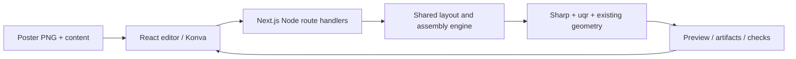

# Web QR poster editor

Status: implemented; the web editor is the supported product interface and the CLI has been retired (see step 6). This document is the design record. The server-rendering parts (Node route handlers, `src/server/`, multipart requests, base64 artifact transport, the `BUSY` gate) have been **superseded** by the client-side pipeline in [client-render-migration.md](client-render-migration.md) — keep reading them as design history, not as the shipped architecture.

## Product goal

The error-correction and pixel-style cards preview QR styling encoded from an empty text value, so the options remain visible and comparable before content is entered.

## Reactive workspace (implemented 2026-09-22)

The shipped editor no longer uses the four-step navigation model. Its header owns a controlled draft Text or URL field and a Generate submit that commits valid input; draft typing does not touch the worker or current preview. The committed value drives automatic mask derivation and debounced worker preparation. Empty committed input shows the selected region highlighted on the poster without preparing a QR; if a committed QR cannot fit inside the selected region, the preview falls back to the highlighted region without a QR. In either region-only view, **Fill region** lets the user click an enclosed mask area to add it to the selected mask and visible highlight, and Escape exits fill mode. The updated mask is used when the preview is prepared again. Non-empty values derive a letter in the Fathead font, and plain text uses its first ASCII letter or digit. Assembly requires valid input.

Desktop renders persistent Mask selection, Preview canvas, and Pattern settings columns. At the mobile breakpoint the same mask and pattern-settings instances become left/right native modal drawers with focus return, Escape/backdrop dismissal, and reduced-motion-safe presentation. There is no separate mask preview in the mask panel; in the region-only poster preview, **Fill region** lets the user click an enclosed mask area to add it to the selected mask and visible highlight, and Escape exits fill mode. The updated mask is used when the preview is prepared again. Selecting a mask text/font/blank/icon switches to manual mode, while Follow input restores automatic updates. After a commit, pattern settings and placement edits refresh the preview without a Continue or completion Generate step. Full-resolution assembly/download remains an export action and renderer invariants are unchanged.

### Editor state migration (implemented 2026-09-22)

Each mounted editor now creates one vanilla Zustand store through `EditorStoreProvider`. The store owns document/revision transitions, draft validation, source Files, mask selection, icon-search state, and panel state; derived readiness and error values live in pure selectors. The pure reducer remains the revision/stale-completion boundary. Worker handles, timers, async tokens, DOM/canvas refs, and Blob URLs remain runtime-local, and the owned worker is disposed on unmount so a remounted editor can safely restart at revision zero. Zundo retains up to 50 previous dated state snapshots plus the current one in memory for read-only tracing; Files, Blobs, and icon payloads are omitted. There is no persistence, URL synchronization, external logging, or undo/redo UI.

Upload a PNG poster containing a solid black region, enter the text or URL to encode, move and resize the QR on the poster, then assemble and download the finished PNG. Use the existing deterministic assembly style: rounded decorative QR cells inside the black region and the real QR at the selected position.

The black region is part of the uploaded poster, not a second required file. Detect it automatically and show a translucent selection overlay before assembly. Preserve the original poster dimensions and all pixels outside the selected region.

### First release

1. **Content:** accept one nonblank line of text or a URL as step 1, before mask selection. Preserve the exact entered value, including surrounding spaces; use trimming only to detect an empty value. Report newline and QR-capacity errors beside the field. A URL is encoded as text and is never fetched.
2. **Mask Search:** no size or poster/mask upload. The mask comes from a 10-character search field (`TEXT_MASK_MAX_LENGTH=10`) whose first character drives the letter tiles (including **blank** for full canvas, fonts in `public/fonts` white on black at full poster height; see `public/fonts/ATTRIBUTION.md`). The fixed 3×4 grid stays the twelve bundled font tiles and keeps the first-letter rule; icons are searched from the single combined control below the grid. That control is always visible and its label is re-derived from the input on every step-2 render (`searchControlState`): `search <query>` before a term is looked up, `more — N icons` once it is, `⋯ searching…` while a request is in flight, and `search icons` with a hint when the field is empty. One click fetches `GET /api/icons?q=` (proxied to `https://icons.grida.co/api/search?q=`, one character or more) and opens a modal `<dialog>` listing the icons as soon as they come back; an empty result reports no icons, and a cached term just reopens the same dialog. `IconGallery` owns that dialog: `showModal()` puts the card, its `::backdrop`, the inert background and focus handling in the browser's hands, `closedby="any"` adds light dismiss (with a coordinate-checked click fallback for engines without it), Escape and **Close** fire the `close` event that clears the reducer's `galleryMode`. Gallery tiles reuse the sidebar letter-tile size (`ui.fontCard`/`ui.fontGlyph` in a 3-column grid) with the icon art drawn directly on the card — no black chip — and the name initial is a load-failure fallback only. Only the latest term is cached, so entering step 2 or editing the input re-derives the label and closes the dialog without refetching. Clicking any tile draws its white-on-black mask on the fixed 1000×1000 canvas (letters via `drawTextMask`, icons via `drawIconMask` recolored to white and scaled to fill 80% while preserving aspect) with no separate size or apply button.
3. **Position:** generate the QR and suggest an assembly-valid position. Let users drag it, resize with corner handles, rotate it freely with the Transformer rotation handle (any angle, stored in placement, default 0 — no snap in this migration), and nudge it with the arrow keys or the on-screen direction buttons. Keep the rotated QR plate entirely inside the selected region; the whole upright plate is rotated once during compositing with nearest-neighbour sampling, so QR generation itself stays rotation-unaware. The rotated working frame is built from the exact painted-region AABB (`regionPixelBounds` takes the maxima over every selected pixel, not the last scanned row), and a shared frame-coverage guard rejects any placement whose plate the frame cannot hold, both at validation time (editor flags it before export) and in assembly (mandatory rejection, never a silently clipped plate). Placement always stays sendable: drags and nudges clamp to the poster origin, and a content or error-correction change that alters the module count re-centres the previous box on the new size inside the canvas before it is revalidated — rotation travels with the placement. An invalid placement is flagged in the sidebar and left where it is, never silently moved.
4. **Assemble:** render the full-resolution result from the current content, placement, and seed. Display progress, show the result, and let users return to editing. Changing an input makes the previous result stale and disables its download until reassembled.
5. **Download:** offer `poster.png` at original resolution. Put the QR PNG, transparent cut PNG, cut SVG, mask PNG, and verification report behind an optional details section. No account is required.

Keep the seed stable internally across edits, along with pixel style (`square`, `rounded`, `dot` matching `qrcode.antfu.me`), a fixed 1-module finder margin, plate corner treatment, rim thickness 0–5, and rounded rim (antialiased). The region-only preview toolbar places **Fill region** and the one-module **Add Rim** toggle together at its top-right. Marker styling lives in small dialogs opened from hovered/found markers on the canvas: the three 7×7 finder markers share one finder dialog (marker pixel style `square`/`round`, marker shape `square`/`round`/`octagon`, marker inner `square`/`round`/`plus`/`diamond`) and the bottom-right 5×5 alignment marker (version ≥ 2 only) opens the sub marker dialog (`square`/`circle`). Do not present the old numeric cut-radius control as general silhouette rounding: in assembly it only chooses the marker-corner treatment. Step 1 offers example QR buttons for quick content selection.

Excluded from this migration: paid Qwen generation, QR image uploads, standalone pattern-preview/pattern-cut tools, freehand mask painting, text printed on the poster, multiple QRs, accounts, saved projects, and a template marketplace.

## Dependency choices

Prefer established packages and framework/browser primitives for general functionality. The choices below prioritize ecosystem adoption and suitability; they are not a claim of a measured download ranking. Select mutually compatible stable versions at implementation time and commit the pnpm lockfile.

| Responsibility                                 | Choice                                                                                    | Why / boundary                                                                                                                                                                                                                                                                                                                                     |
| ---------------------------------------------- | ----------------------------------------------------------------------------------------- | -------------------------------------------------------------------------------------------------------------------------------------------------------------------------------------------------------------------------------------------------------------------------------------------------------------------------------------------------- |
| Web application and HTTP endpoints             | Next.js App Router, React, TypeScript                                                     | One application for the editor and Node rendering endpoints; no separate API framework. [Route Handlers](https://nextjs.org/docs/app/api-reference/file-conventions/route) support standard Request/Response and multipart form data. _(Superseded: the render endpoints were removed in the client render migration; only `/api/icons` remains.)_ |
| Canvas interactions                            | `konva` + `react-konva`                                                                   | Use the existing scene graph, dragging, hit testing, and [Transformer](https://konvajs.org/docs/react/Transformer.html) for handles. Write only placement constraints and coordinate conversion.                                                                                                                                                   |
| Image decoding, compositing, PNG/SVG rendering | Existing `sharp`                                                                          | Retain the current server renderer and raw-pixel checks. Configure its documented [input pixel limit](https://sharp.pixelplumbing.com/api-constructor/). _(Superseded: sharp is dev-only as the Node test backend behind the imaging seam; the browser uses `@jsquash/png` + `@resvg/resvg-wasm`.)_                                                |
| QR encoding and module classification          | Existing `uqr`                                                                            | [Its encoder](https://github.com/unjs/uqr) exposes the matrix and cell types required by marker removal. Keep it even though generic QR widgets are more common; switching would jeopardize style and module parity.                                                                                                                               |
| QR verification                                | Existing `@zxing/library` and `jsqr`                                                      | Retain the tested decoder chain. No custom decoder.                                                                                                                                                                                                                                                                                                |
| Request and form validation                    | `zod`                                                                                     | Shared [runtime schemas](https://zod.dev/) and inferred types; image and placement checks remain authoritative on the server.                                                                                                                                                                                                                      |
| Tests                                          | Existing Vitest + Playwright                                                              | Preserve pixel/geometry tests; add [browser workflow tests](https://playwright.dev/docs/intro) for upload, editing, and download.                                                                                                                                                                                                                  |
| Simple UI state, uploads, downloads            | Editor-scoped Zustand store, native form controls, Fetch, File/Blob references, Blob URLs | One vanilla store per mounted editor; runtime handles and object URLs remain outside observable state.                                                                                                                                                                                                                                             |
| Component styling                              | StyleX (`@stylexjs/stylex`, Babel + PostCSS plugins)                                      | [Compile-time atomic CSS](https://stylexjs.com) with a typed token layer and layer-based cascade instead of one hand-maintained global stylesheet; no runtime style injection.                                                                                                                                                                     |

Reuse the project-specific detector, safe-module calculation, phase locking, four-module rim, plate geometry, seeded pattern logic, and rounded cell geometry. These are the product's existing algorithms. Do not reimplement PNG codecs, QR encoding, canvas manipulation, multipart parsing, or validation libraries. Do not add a tracing library for assembly: its boundary consists of whole modules, not a traced silhouette.

## Architecture

**Superseded:** the shipped architecture is browser-only — see [client-render-migration.md](client-render-migration.md), which moved `prepareEditor`/`assembleFromBuffers` orchestration into `src/lib/editor/engine/` running in a Web Worker and deleted the server render API. What follows is the original server-rendering design.

Use a browser editor plus a Node server. Sharp, filesystem APIs, and Buffer-dependent rendering stay in server-only modules. The browser owns interaction state and displays server-rendered images; final export always comes from the shared assembly engine. This preserves the current renderer without a browser/WASM rewrite.



### Separate computation from file I/O first

`src/layout.ts` currently reads paths, and `src/assemble.ts` both computes the result and writes artifacts. Extract buffer-based services before building the UI:

- `prepareEditor({ posterBytes, content, maskBytes? })` returns dimensions, detected mask preview, QR image/metadata, and an assembly-valid initial placement.
- `validatePlacement({ regionMask, qrMetadata, placement, settings })` checks fit, safe cells, remaining texture, and pattern crop feasibility. Share pure coordinate rules with the client; server validation remains required.
- `assembleFromBuffers({ posterBytes, content, maskBytes?, placement, seed, qrMargin, plateCorners })` returns artifact buffers and the verification report.
- Keep temporary CLI adapters that call these services and write the existing filenames. Do not invoke the CLI as a subprocess from a web request.
- Preserve schema-8 assembly reports during migration. Put web revision and response metadata in a separate versioned API envelope, not in incompatible changes to the existing report. Web reports use logical input names rather than server paths.

Structure after migration (implemented):

```text
src/app/                         # Page, layout, Node route handlers
src/components/editor/          # Step components and editor hooks (upload, mask, icons), Konva canvas, result
src/lib/editor/                 # Reducer, coordinate mapping, request schemas
src/server/                     # Buffer services, validation, response adapters
src/core/                       # Reused QR, mask, placement, pattern, assembly
test/                           # Engine and route regression tests
e2e/                            # Playwright user journeys
```

### API and data lifetime

**Superseded:** there are no render endpoints anymore; `/api/icons` is the only API route. The files never leave the browser and the worker keeps source artifacts in memory between edits. Kept as design history:

Start with stateless requests. The browser retains the original File objects and resends them when required; the server retains no uploaded assets between requests. This avoids sessions, databases, and cleanup jobs for the first release.

| Endpoint             | Input                                                                           | Output                                                                                                                            |
| -------------------- | ------------------------------------------------------------------------------- | --------------------------------------------------------------------------------------------------------------------------------- |
| `POST /api/prepare`  | Multipart poster, optional mask, content, editor revision                       | Versioned JSON with dimensions, mask/QR PNG previews, QR version/module count, suggested placement, validation messages, revision |
| `POST /api/assemble` | Same files plus Zod-validated JSON settings, explicit placement, seed, revision | Versioned JSON with canonical placement, artifacts encoded as base64, report, revision                                            |

Base64 is a deliberate initial transport simplification with roughly one-third byte overhead. Convert it to Blob URLs for display/download and revoke them on replacement or unmount. Include response memory in the input-size benchmark; move to binary artifact delivery only if measured limits require it. Mark responses `Cache-Control: no-store` and never log file bytes or QR text.

Use Node runtime route handlers. Validate PNG signatures/decoded format, dimensions, content, integers, masks, and settings server-side. Proposed initial limits: 10 MiB per image, 16 megapixels, one frame; also enforce a bounded total multipart body at ingress before parsing, with room for both files. Benchmark these limits and lower them if the existing integral arrays and artifact generation exceed the deployment memory budget. Bound active rendering concurrency and return a retryable busy response instead of accumulating unlimited jobs.

Return structured errors `{ code, message, field?, revision }`: 400 for malformed requests, 413 for upload limits, 422 for invalid content/mask/layout, and 500 for rendering or invariant failures. The UI retains inputs and offers retry. Abort superseded requests and ignore stale responses using a monotonically increasing editor revision; aborting a fetch does not guarantee that server computation stops.

## Placement and preview correctness

- Store all geometry in original poster pixels, never CSS/display pixels. Invert Konva's stage transform when mapping pointer positions so zoom, pan, and device pixel ratio cannot change export placement.
- Define X/Y as the top-left of the normalized QR square, including its existing two-module source margin. Let `n` be the code-grid module count and `p` the integer pitch: `size = (n + 4) * p`.
- Snap X/Y to integer poster pixels and size to a positive integer pitch. The lattice moves with the QR; do not snap position to an unrelated global grid. Convert Transformer scale into canonical size and reset node scale to 1 after committing a resize.
- Draw immediate drag/resize feedback locally. On commit, apply shared fit rules and flag invalid placement. Never silently move a manually positioned QR during assembly; return a layout error so the user can adjust it.
- Step 2 Continue runs the minimum 4px fit check on click against the prepared preview: the `REGION_TOO_SMALL_MESSAGE` failure stays hidden until Continue is clicked, then it appears on step 2 and blocks entry to step 3 (including StepRail jumps) until a larger region is supplied. Stale prepared placements never unlock the next step. No client-side fit pre-test runs after the preview.
- Recompute QR metadata when text changes. Keep the previous center/pitch where possible, then revalidate the new size; surface invalid placement instead of exporting the old content.
- Automatic placement must satisfy assembly, not just square containment. Try the current placement candidate, then smaller integer pitches/valid candidates until the rim, plate, remaining texture, and phase-locked crop all work. Return a clear error if none do.
- A drag preview is an editing aid. The assembled preview displays the actual returned PNG, with no canvas re-export or second rasterization. Reuse the same canonical settings for preview and download.

## Assembly contract to preserve

1. Generate the real QR from content with the current `uqr` defaults and selectable pixel style (`square`/`rounded`/`dot`); normalize at integer pitch and verify its decoded text.
2. Detect/select the poster region and validate the whole normalized QR square inside it.
3. Generate the seeded marker-free texture and phase-lock it to the QR lattice, with the existing extra-module crop headroom.
4. Draw only complete modules entirely inside the region and canvas, in the chosen pixel style. Force the outer 0–5 safe-module rings dark (rounded rim is antialiased); the plate does not seed this rim. Rounded keeps the blended wedge geometry from `qrcode.antfu.me`.
5. Cut the current module plate and overlay the exact normalized QR pixels belonging to it, keeping the existing finder-only band of one module and corner behavior.
6. Preserve pixels outside the region, partially covered modules, and the original alpha channel. Reject layouts with no remaining texture.
7. Run all existing mandatory schema-8 checks. Keep `poster`, `posterHalfScale`, and `posterJpeg80` in skipped checks and `phoneScan: untested`; do not present the artistic result as scan-certified. Show a concise result note: “Artistic margins can affect scanning. Test the downloaded poster with your phone.”

The full normalized QR square is the placement constraint; the smaller module plate is the actual compositing footprint. Keep that distinction in engine tests and do not enlarge the plate to the preview bounding box.

## Sequenced implementation and gates

### 1. Extract and freeze the reusable engine

- Capture fixed-content, fixed-seed fixture results before refactoring.
- Extract in-memory preparation/assembly and move CLI filesystem work into adapters.
- Eliminate the current `layout -> qr -> pattern -> layout` dependency cycle by separating QR rendering and shared constants/types as needed.
- Gate: CLI results remain equivalent in decoded pixels, masks, placement, and geometry; deterministic image bytes remain stable under the same dependency versions. Compare reports excluding timestamps, durations, and input/output paths. All existing tests, typecheck, and build pass.

### 2. Add the web shell and upload/content preparation

- Install the selected web dependencies, add scripts, and isolate server imports from the client bundle.
- Implement request schemas, bounded upload handling, preparation endpoint, region overlay, and generated QR preview.
- Gate: bundled poster plus text produces a valid initial layout; corrupt PNGs, wrong-size masks, missing regions, empty/multiline/oversize content, and oversized uploads produce useful errors without losing the form state.

### 3. Add position and size editing

- Integrate Konva dragging/Transformer, numeric fields, keyboard controls, zoom, reset, and integer snapping.
- Add content-change invalidation and revision tracking. Assembly stays disabled while content or placement is invalid.
- Gate: pointer, touch, and keyboard edits produce the same canonical coordinates at multiple zoom levels; invalid edge/hole placements are rejected; resizing and longer content cannot leave an obsolete QR preview eligible for download.

### 4. Connect assembly and downloads

- Call the in-memory engine with the user's explicit placement; display the exact output PNG and optional artifacts/report.
- Handle stale responses, retry, new pattern, and Blob URL cleanup.
- Gate: browser upload -> content -> move -> resize -> assemble -> download succeeds. The downloaded PNG matches engine output at that placement, retains original dimensions, and passes mandatory pixel checks. Test concurrent independent users, repeated edits, and request failures.

### 5. Validate the runnable web release

- Run Vitest, typecheck, production build, and Playwright against the production server.
- Cover Chromium, Firefox, and WebKit plus a touch viewport. Exercise small/large posters, multiple QR versions, mask holes, partial cells, the finder margin, both corner options, and deterministic seeds.
- Measure preparation/assembly latency and peak memory at upload limits on the target Node host. Use a host/container supporting Sharp and sufficient request duration; a static-only host cannot execute this architecture.
- Gate: tests pass, limits are documented, and the core user journey works from a fresh checkout using web commands only. Deployment configuration belongs to implementation; this plan does not publish anything.

### 6. Retire the CLI (completed)

- Removed `src/cli.ts`, Commander, the `qr-poster` bin entry, CLI-only scripts/options, and CLI-only tests.
- Removed the retired Qwen/generation/dry-run orchestration and standalone mode entry points after checking imports. The engine moved to `src/core/`; shared mask, SVG, QR, and geometry helpers still used by web assembly were kept, including `pattern-cut.ts` (trimmed to its trace/fillet/SVG/coverage helpers, which assembly uses via `buildCutSvg`).
- Kept engine and route tests plus fixtures (`source/poster.png`, used by the buffer tests). CLI end-to-end coverage was replaced with API/browser coverage before deletion. Unused dependencies were removed after an import audit; Sharp, uqr, and both decoders are retained.
- Make `pnpm dev`, `pnpm build`, and `pnpm start` the web commands; retain `pnpm test` and `pnpm typecheck`, and add `pnpm test:e2e`.
- Rewrite README and AGENTS.md around the web workflow and mark the previous artistic-QR plan as historical. Remove obsolete CLI/Qwen setup instructions from active documentation, retaining useful design history and verification contracts.
- Final gate: no active CLI imports or scripts remain; clean-install build, engine tests, API tests, and browser journey pass. The web app is the only supported product interface.

### 7. Add lint and format tooling (completed)

- `oxlint` and `oxfmt` are dev dependencies driven by `.oxlintrc.json` and `.oxfmtrc.json`, with `pnpm lint`, `pnpm lint:fix`, `pnpm format`, and `pnpm format:check`. Neither tool runs in a request; they touch only source, test, and config files.
- Lint config keeps the correctness category as errors, scopes browser globals to components/lib/app and Node globals to core/server/api/tests, and leaves two project-owned rules off: `nextjs/no-img-element` because previews render blob/data URLs, and the React Compiler diagnostics `react/set-state-in-effect` and `react/refs` because the compiler is not enabled.
- Format config encodes the repo style: single quotes, no semicolons, two spaces, trailing commas, 120 columns, and generated directories ignored.
- The first lint run was fixed rather than suppressed: retired-CLI dead helpers and imports left in `src/core/pattern.ts` and `src/core/assemble.ts`, unused test/e2e variables, and one redundant regex escape are gone, so `pnpm lint` passes on a fresh checkout. The wordmark now uses `next/link` instead of a raw `<a href="/">`.
- Adopting the formatter repo-wide is opt-in: existing sources pack several statements per line, so `pnpm format` rewrites most files. Run it deliberately, then keep `pnpm format:check` green.
- Gate: `pnpm lint` passes on a fresh checkout and `pnpm test`, `pnpm typecheck`, and `pnpm build` stay green.

### 8. Adopt StyleX for the component styles (completed)

- The 869-line `src/app/globals.css` is gone. Styles are authored with `stylex.create()`/`stylex.props()`: `src/styles/tokens.stylex.ts` defines the palette, sketch geometry, shadows, and type stack with `defineVars`; `src/styles/ui.stylex.ts` holds the recipes shared across surfaces (buttons, fields, hints, cards, headings); each component owns its remaining layout styles.
- Only three things stay in CSS: the `@font-face` declarations for the bundled mask fonts, an `@layer reset` block (`box-sizing` plus `text-size-adjust`), and the `@stylex` directive the PostCSS plugin replaces.
- Build wiring follows StyleX's documented Next.js setup: `babel.config.json` (`next/babel` plus `@stylexjs/babel-plugin` with `runtimeInjection: false`) compiles the styles, and `postcss.config.mjs` reuses those plugins plus `autoprefixer` to extract the CSS. Next 16.0.3+ runs both under Turbopack, so the dev/build/start scripts keep their defaults. The Babel config must be JSON because Next's Babel loader rejects `.cjs`/`.mjs` config files and this package is `"type": "module"`.
- StyleX has no element or descendant selectors, so rules that relied on them became explicit props: `section h2 span`, `details label`, `.font-card .font-glyph`, `.steps li:nth-child(even) button`, `.steps button[aria-current]`, `.workspace-step2 .preview-panel`, `.downloads a`, `canvas[aria-label='Mask text preview']`, and the Konva content box. The even-child tilt is applied by index (it still survives `:disabled`, as the original cascade did), and the poster frame is now a StyleX wrapper instead of a rule aimed at Konva's own `.konvajs-content`.
- Deliberate rendering differences, each a fix rather than a restyle: the preview frame is drawn on all four sides (Konva's content box used to overpaint its right/bottom border), the responsive `.steps` paddings now apply (a duplicated trailing rule used to cancel the ≤1000px/≤700px values), `transition-property` names `background-color` so the hover fade actually runs, and a focused textarea/select keeps its sketch radius instead of snapping to 6px.
- Verification: the pre-change commit and the StyleX version were rendered side by side (desktop 1440×1000 and mobile 390×844, steps 1–4 plus the icon gallery and the error state) and compared pixel by pixel, with a full-DOM computed-style diff to catch anything the screenshots hid. Steps 1–2 match exactly; the remaining differences are the four items above and the retired `--*` custom properties. `IconGallery` exposes `data-testid="icon-gallery"` for Playwright now that class names are generated.
- Gate: `pnpm lint`, `pnpm format:check`, `pnpm test`, `pnpm typecheck`, `pnpm build`, and the Chromium e2e journey all pass.

### 9. Split the step panels into deferred chunks (completed, 2026-09-21)

- The editor sidebar/preview shells load eagerly; the remaining heavier panels are deferred with `next/dynamic` in the client components: `PatternSettings`, `MarkerDialog`, and `ResultPanel` in `PreviewPanel.tsx`, plus `IconGallery` in `Editor.tsx`. Phase-specific `stepWarmers` fetch the next step's chunks once the current step is open (step 1 warms only after the content passes validation), so transitions only swap already-loaded modules and first paint on step 1 downloads none of them.
- Measured on the production build (`pnpm build` + `pnpm start`, script list from the served HTML): initial JS for the step-1 visitor fell from ~1,050 KB to ~860 KB raw (~295 KB → ~230 KB gzipped). Browser LCP/INP traces remain to be recorded by the maintainer per [modern-web-optimization.md](modern-web-optimization.md).
- The `_not-found`/root barrier and step-1 prerender stay unchanged; no `ssr: false` moved into a Server Component.
- Gate: `pnpm test`, `pnpm typecheck`, and `pnpm build` pass.

### 10. Deploy to Cloudflare Workers with vinext (completed, 2026-09-21)

- The editor deploys to one Cloudflare Worker via [vinext](https://vinext.dev): the Worker serves the page, static assets, and the `GET /api/icons` proxy, with no KV/R2/D1/Images bindings and no render API. The pipeline contract is untouched — poster bytes, masks, and exports stay in the visitor's Web Worker.
- The Node toolchain is untouched: `pnpm dev`, `pnpm build`, and `pnpm start` keep their Next.js/Turbopack defaults; `vite.config.ts` adds the parallel `dev:vinext`/`build:vinext`/`preview:workers`/`deploy:workers` path.
- Three compatibility gaps between the toolchains, each fixed without changing rendering behavior: (1) Vite never reads `babel.config.json`, so `vite.config.ts` re-applies `@stylexjs/babel-plugin` with the same options to app source — otherwise `stylex.create`/`defineVars` throw at runtime; (2) Vite's worker bundling compiles `.wasm` into modules with unresolvable `wbg` imports, so `vite.config.ts` rewrites the codec imports to asset URLs — the same `{ default: url }` contract as the Turbopack `asset` rule — and the codecs' own inits supply their wasm-bindgen imports; (3) `src/core/pattern-cut.ts` now base64-encodes via `btoa` instead of Node's `Buffer`, which the Workers runtime lacks (Turbopack shims it). `src/lib/editor/worker/window-shim.ts` aliases `window` to the worker global because ZXing's PDF417 tables read `window.BigInt` at module scope (Turbopack shims `window` in worker output; Vite does not), and the worker output format is ES module for the top-level-await WASM inits.
- Verified in the local Workers preview: the full journey (content → mask search with a live icon-proxy query → adjust → assemble → download) runs with zero console errors, both codec binaries serve as `application/wasm`, the assembled bytes are identical (same fixed seed) to the Node production build, and the preview/download link still share one Blob URL.
- Gate: `pnpm test`, `pnpm typecheck`, `pnpm build`, and `pnpm build:vinext` all pass; `wrangler dev` preview passes the browser journey. Deployment to `*.workers.dev`, the custom domain, and rollback verification are maintainer steps once a Cloudflare account is connected (commands in README).
